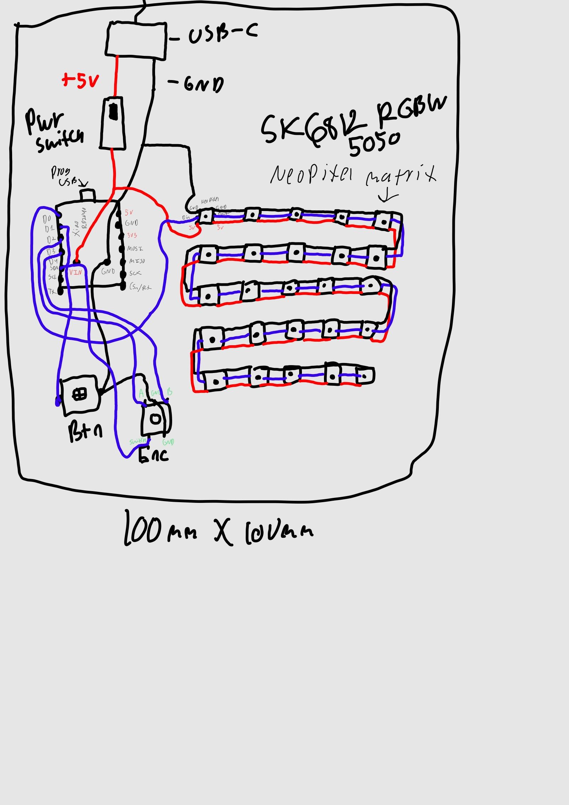
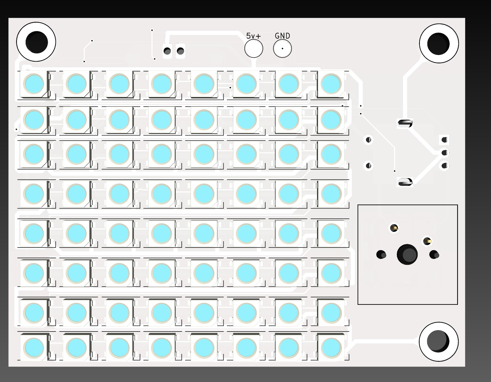
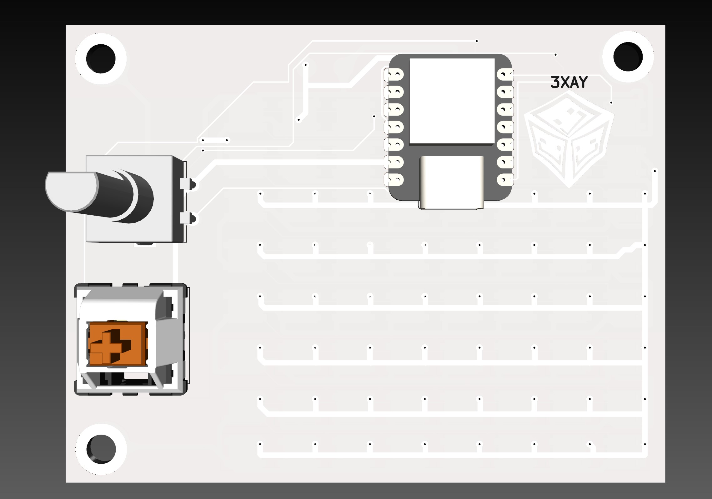
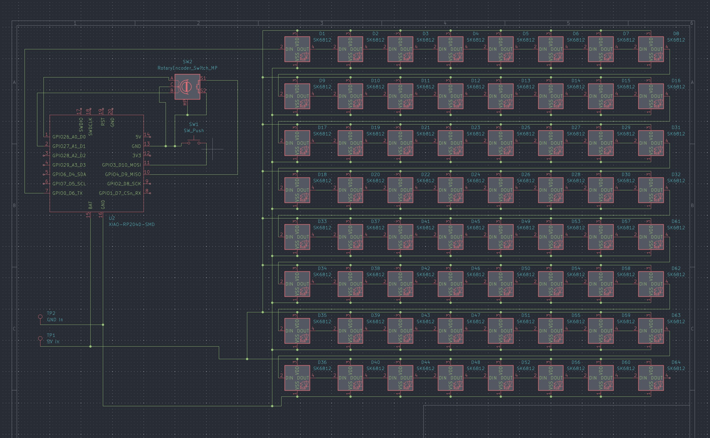

# Lightbox

Wokwi link: https://wokwi.com/projects/427712521108601857

# Idea (Planning)
A low-cost RGBW light box. Should be easy to use + have a standard mounting system on the back to allow for various attachments.
Mounting holes could be something like VESA 75x75 so standard mounts could be used + adapter plates could be 3D printed to allow for other custom mounting solutions.
Ex. Make a "hotswap" plate that screws into the VESA holes, and then make various arms and stands that use the hotswap plate to simply latch the box in.
Probably an 8x8 grid of LEDs.

# Controls
1 encoder + switch, and 1 switch. Encoder presses toggles between R, G, B, and brightness channels. The knob increases / decreases them.
The switch can cycle through different presets. (Ex. make a text file with RGBW values (255, 255, 255, 255) and have each line be a different preset, then the button can loop through the lines to allow for the next preset to be selected)

# Sketches

# BOM
* Xiao RP2040: $3.99
* PCB: $2.00
* PCB Shipping: $1.50
* [SK6812-5050, 7000K (65x): $7.51](https://www.lcsc.com/product-detail/RGB-LEDs-Built-in-IC_OPSCO-Optoelectronics-SKC6812RGBW-BW-B_C5380878.html)
* Cherry MX-style switch: ~$0.20/switch (I already have them)
* [EC11 Encoder with Switch: $1.99](https://www.lcsc.com/product-detail/Rotary-Encoders_ALPSALPINE-EC11E18244AU_C202365.html?s_z=n_EC11)
* [USB-C Port (2P): $0.60](https://www.lcsc.com/product-detail/USB-Connectors_SAMZO-FKAKALCCA_C39833028.html)
* [Power rocker switch: $0.43](https://www.lcsc.com/product-detail/Rocker-Switches_HCTL-RS601A-1010013BB_C5124217.html)
* Total: $18.02

# Design Process
Since I've already made PCBs for other YSWS programs, it was pretty simple for me to make the schematic, especially since I drew the wiring diagram above beforehand.
Then, it was easy to route the traces on the actual PCB to connect everything, and the hardest part was to make it more compact, but I decided to place the RP2040 on the back, giving me more space.
After that, I made the firmware (or what I could in Wokwi).

# PCB + Schematic

