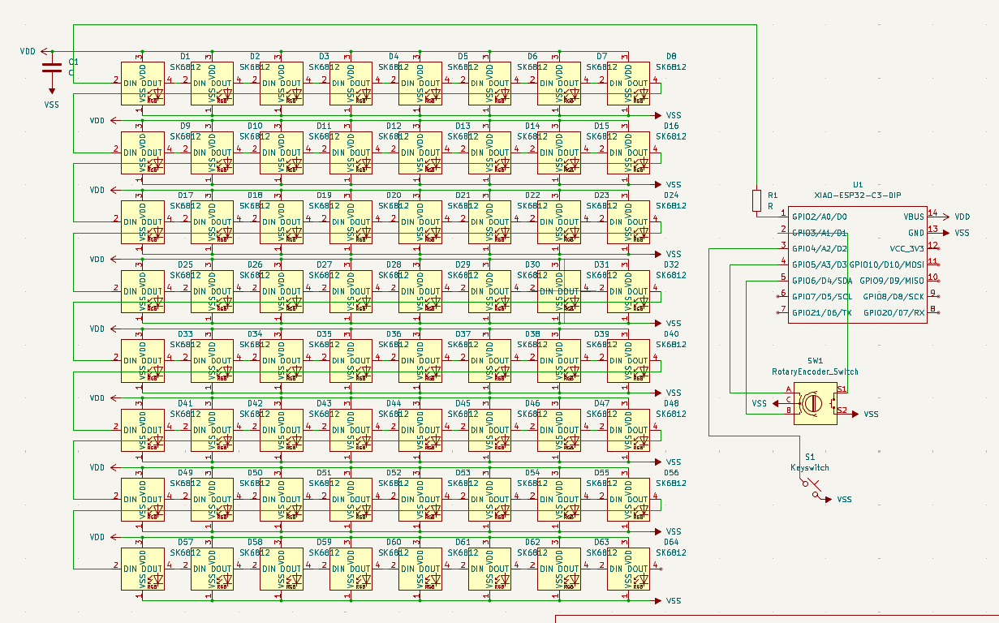
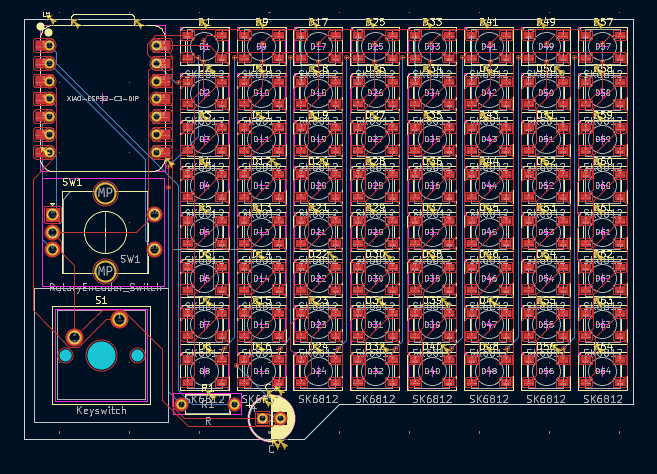

# GIF Matrix

Wokwi link: [https://wokwi.com/projects/428110821658816513](https://wokwi.com/projects/428110821658816513)

I made a simple 8x8 LED matrix that can show gifs from a pregenerated python file.
It also has support for input from a rotary encoder and a switch.

A simplified BOM table
(pls include rough pricing of any extra components you're using)

| Comment           | Footprint                                                            | Quantity | LCSC     | Cost                                    |
|-------------------|----------------------------------------------------------------------|----------|----------|-----------------------------------------|
| 330Ω              | R_Axial_DIN0207_L6.3mm_D2.5mm_P7.62mm_Horizontal                     | 1        | C120043  | 0.056$ for 100, 0.0056$ for 1 (on LCSC) |
| 1000uF            | Capacitor_THT:CP_Radial_D6.3mm_P2.50mm                               | 1        | C251003  | 0.1743$                                 |
| SK6812            | LED_SK6812_PLCC4_5.0x5.0mm_P3.2mm                                    | 64       |          |                                         |
| XIAO-ESP32S3-DIP  | XIAO-ESP32S3-DIP                                                     | 1        |          |                                         |
| Cherry MX         | SW_Cherry_MX_1.00u_PCB                                               | 1        |          | 6.48$ for 8, 1.62$ for 1                |
| Rotary Encoder    | RotaryEncoder_Alps_EC11E-Switch_Vertical_H20mm_CircularMountingHoles | 1        | C202365  | 1.97$                                   |

Schematic:

PCB:

3D PCB:

