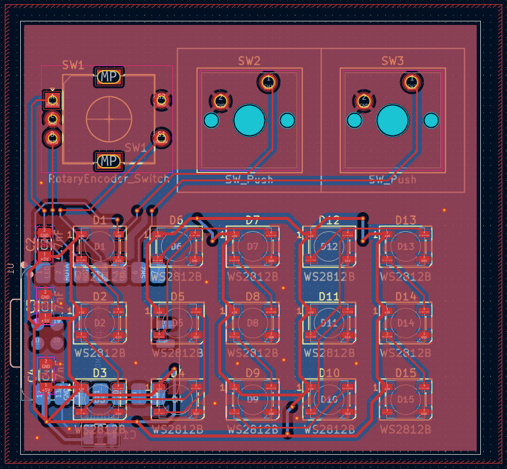
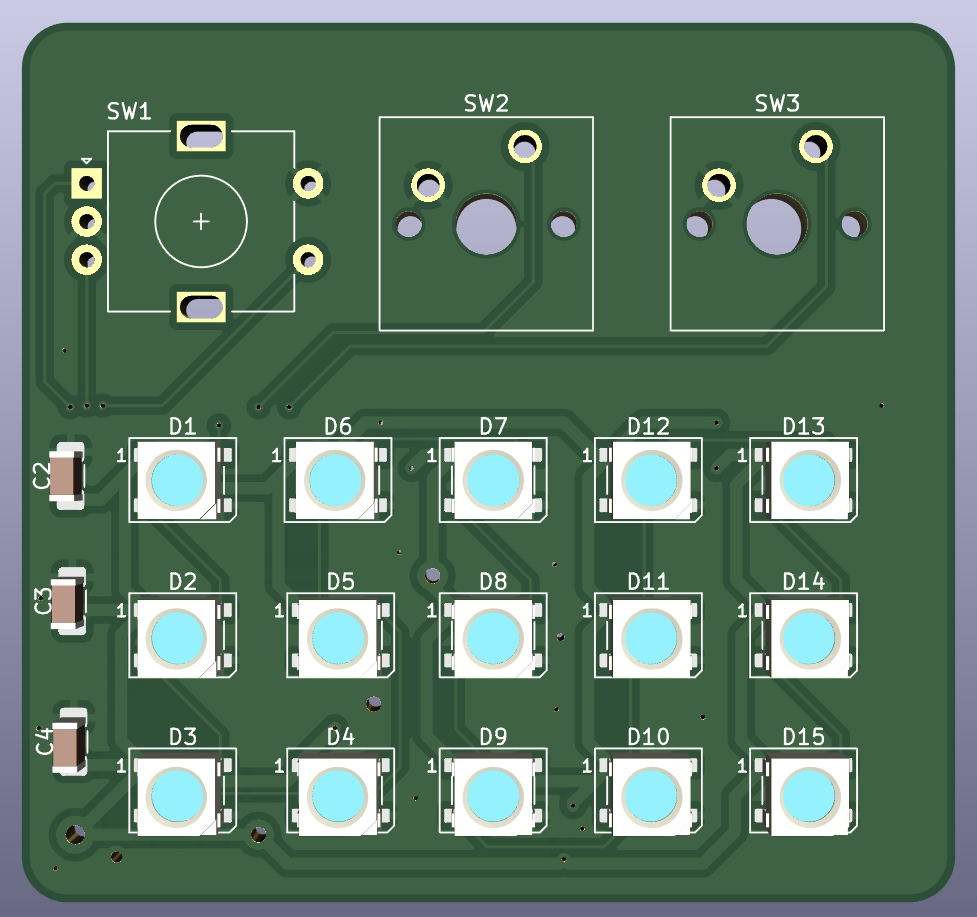
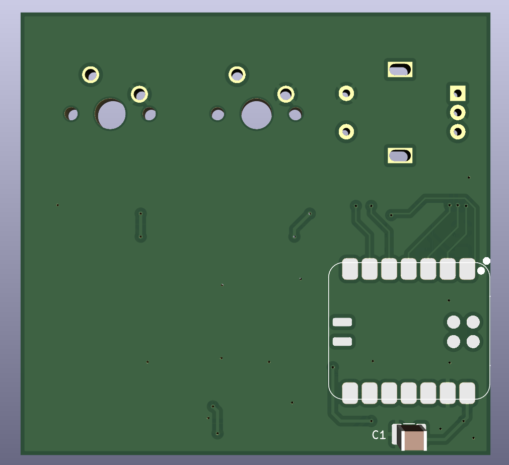

# LightRay

Wokwi link: [https://wokwi.com/projects/427710119861982209](https://wokwi.com/projects/427710119861982209)

LightRay is an LED matrix with a rotary encoder and two switches. The board will be capable of displaying color patterns and shapes, along with the inputs to change the pattern that is displayed.

## BOM

| Component           | Link                                                                                                                                          | Quantity | Total Price |
|---------------------|-----------------------------------------------------------------------------------------------------------------------------------------------|----------|-------------|
| 4.7nF Capacitor     | https://www.lcsc.com/product-detail/Multilayer-Ceramic-Capacitors-MLCC-SMD-SMT_IHHEC-HOLY-STONE-ENTERPRISE-CO-LTD-C1206N472K050T_C105997.html | 3        | $0.19       |
| 100uF Capacitor     | https://www.lcsc.com/product-detail/Multilayer-Ceramic-Capacitors-MLCC-SMD-SMT_HRE-CGA1210X5R107M160RT_C6120014.html                          | 1        | $0.47       |
| EC11 Rotary Encoder | https://www.lcsc.com/product-detail/Rotary-Encoders_ALPSALPINE-EC11E15244G1_C370970.html                                                      | 1        | $2.11       |
| MX-Style Switch     | https://www.aliexpress.us/item/3256804793762918.html                                                                                          | 2        | $0.91       |
| WS2812B-5050        | https://www.lcsc.com/product-detail/RGB-LEDs-Built-in-IC_Worldsemi-WS2812B-B-W_C114586.html?s_z=n_ws2812b%25205050                            | 15       | $1.26       |
| XIAO-RP2040-SMD     |                                                                                                                                               | 1        | 0           |

## Design Process

The board was designed with KiCAD. I realized that I needed the array to large so that it could display all sorts of patterns, but I also wanted it to be compact for when placing near work surfaces. Wowki wasn't the greatest thing to use, and I had issues with wires overlapping and merging together which took quite some time to debug.

