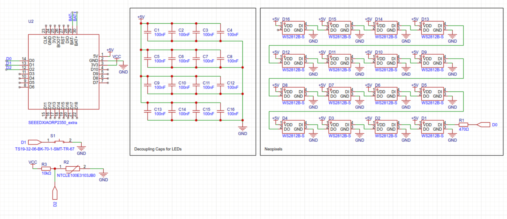
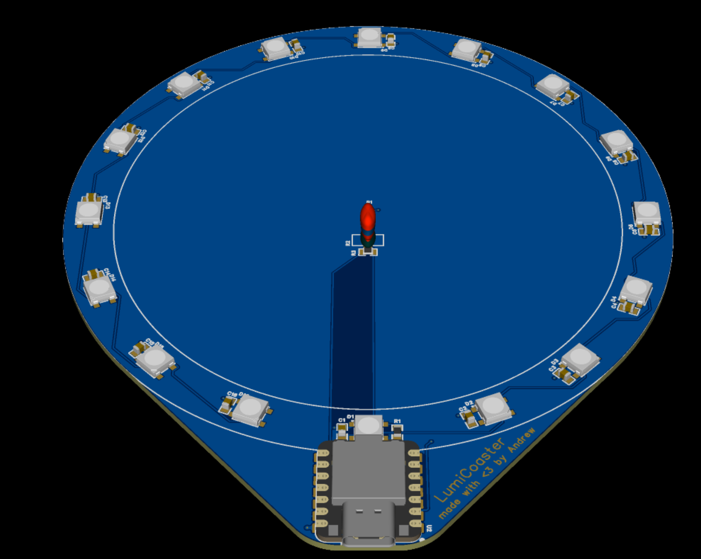

# LumiCoaster

Wokwi link: <https://wokwi.com/projects/427462958740066305>

I'm making a smart coffee (or just in general) cup coaster. It has a center section for the cup to side, which is surrounded by a ring of Neopixels. The ring will be dynamic, and it could do anything, ranging from detecting cup prescence with the switch, or detecting cup temperature with the thermistor. The ring will respond to what it detects.

| No. | Quantity | Manufacturer Part            | Manufacturer                 | Supplier Part                          | Supplier |
|-----|----------|------------------------------|------------------------------|----------------------------------------|----------|
| 1   | 16       | CC0805KRX7R5BB104            | YAGEO(国巨)                    | C1854118                               | LCSC     |
| 2   | 16       | WS2812B-S                    | XINGLIGHT(成兴光)               | C22461793                              | LCSC     |
| 3   | 1        | RC0805FR-07470RL             | YAGEO(国巨)                    | C114564                                | LCSC     |
| 4   | 1        | NTCLE100E3103JB0             | VISHAY(威世)                   | C141588                                | LCSC     |
| 5   | 1        | RC0805JR-0710KL              | YAGEO(国巨)                    | C100047                                | LCSC     |
| 6   | 1        | TS19-32-06-BK-70-1-SMT-TR-67 | Same Sky (Formerly CUI Devices) | 2223-TS19-32-06-BK-70-1-SMT-TR-67CT-ND | DigiKey  |
|     |          |                              |                              |                                        |          |

All components from YAGEO are either capacitors or resistors. The component from VISHAY is a thermistor. The component from Same Sky is a tactile switch.

I started by brainstorming ideas of what I should make. I had a few ideas, but wanted something unique so I ran with the idea of a smart coaster. I started from the ground up designing a schematic, before going into Inkscape to make a rough shape of it. I imported that into my design software, made the ring, and laid everything else out. I didn't have too many troubles, but it was fun learning about addressable LEDs.

