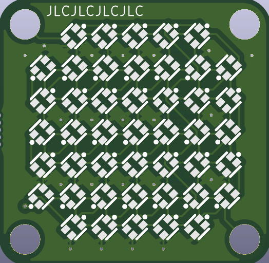
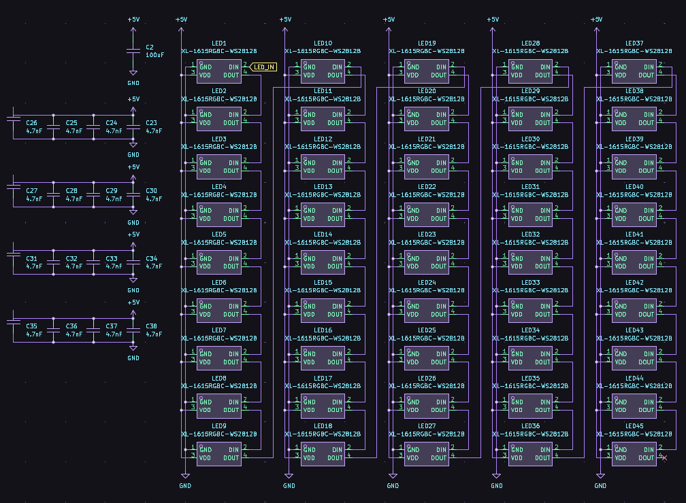
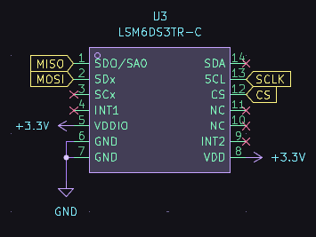
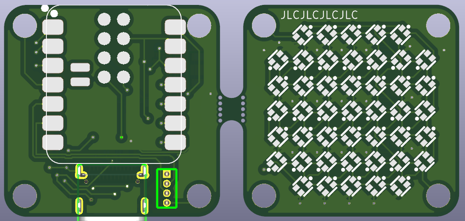
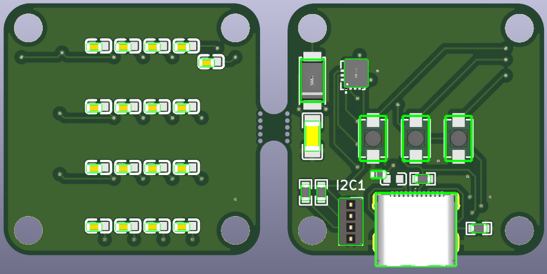
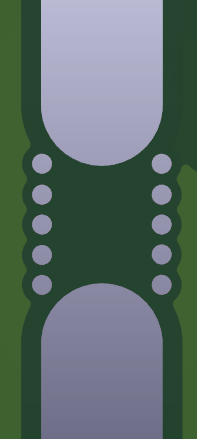

# NeoPOV

Wokwi link: [https://wokwi.com/projects/427583949455617025](https://wokwi.com/projects/427583949455617025)

⚠️ **I would like to have a go at soldering a couple neopixels or the xiao esp32, so I would also need a soldering iron.**

This project uses the `xiao-esp32-s3` and an array of 45 neopixels to display letters dependant on the data from an accelerometer. This can be used to show words or images when moving the leds at a high speed or during a long exposure photo (also known as persistence of vision, hence NeoPOV).

> The neopixel array

> The neopixel schematic

The accelerometer is placed near the center of the board and is connected to the esp32 over SPI.

> The accelerometer

The board is designed in such a way that one side contains the microcontroller and neopixels and the other side contains components that are available for PCBA, which allows economic PCBA in jlcpcb if I ever want to manufacture more.

> The top side

> The bottom side

The board is designed as two parts, connected with mouse bites so that they can be easily seperated. In the corners of each half are M3 mounting holes that carry the power and LED_IN signals between the segments.

> Mouse bites

| Component             | LCSC Number | Quantity | Price ($) |
|-----------------------|-------------|----------|-----------|
| TYPE-C 24P QT         | C2681555    | 1        | 0.44      |
| Conn_01x04_Socket     | C2935874    | 1        | 0.68      |
| XL-1615RGBC-WS2812B   | C5349954    | 45       | 2.49      |
| TS342A2P-WZ           | C557591     | 3        | 0.37      |
| LSM6DS3TR-C           | C967633     | 1        | 1.05      |
| XIAO-ESP32-S3-SMD     | N/A         | 1        | N/A       |

This board was designed using kicad and the LCSC plugin, across multiple days. It has a very small footprint when assembled, so the pcb is very densely packed, which was challenging to design.