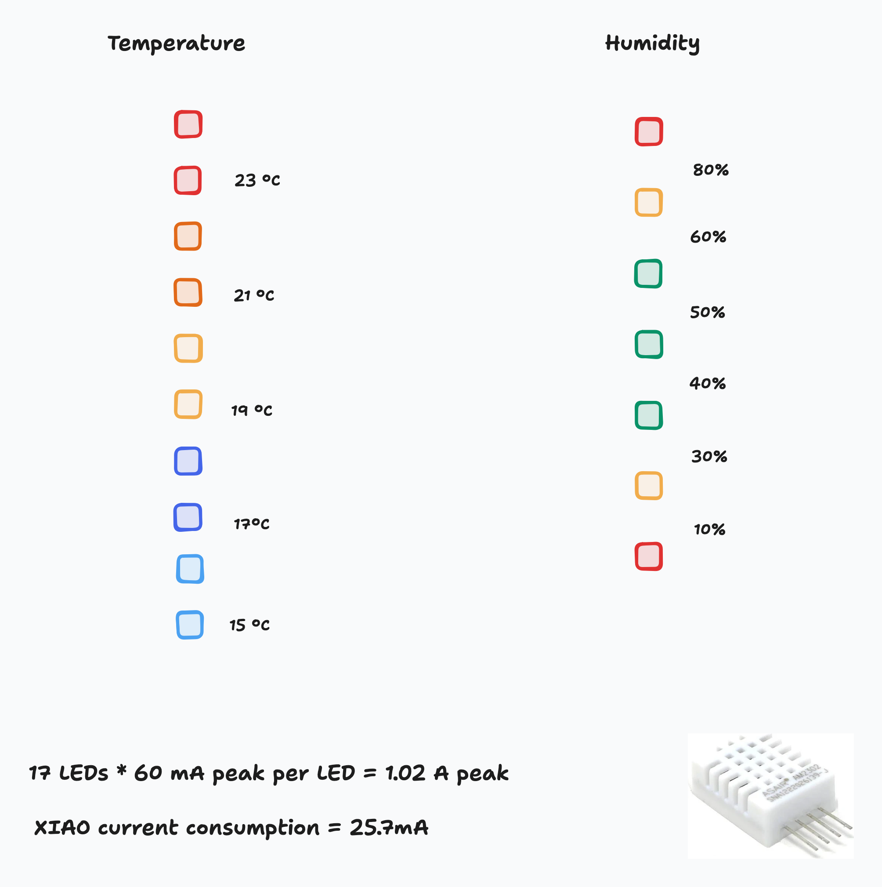
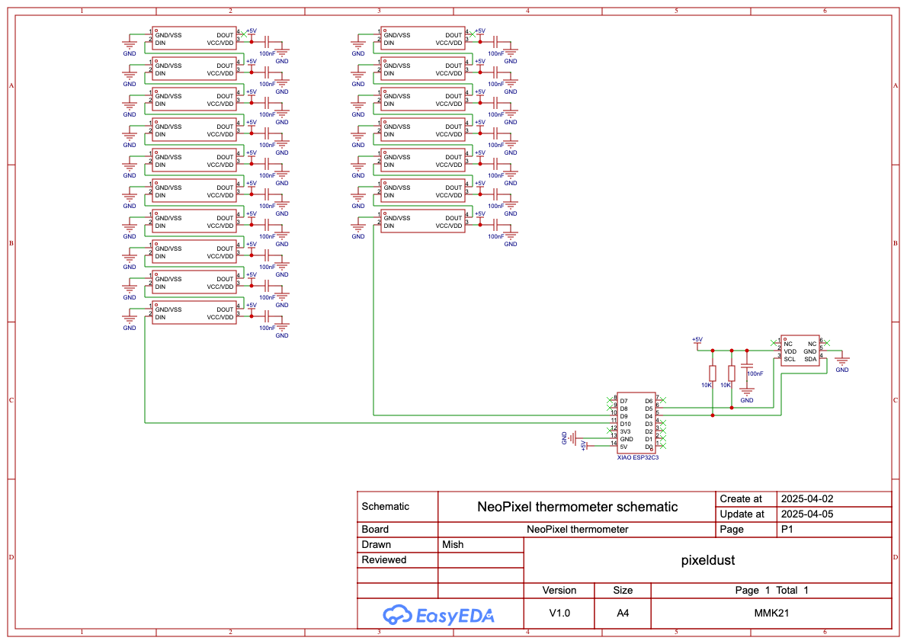
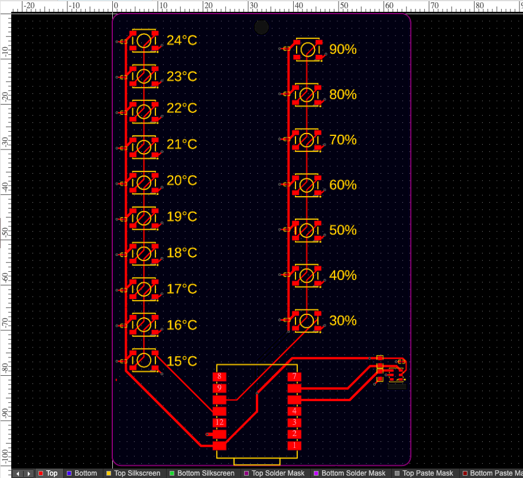
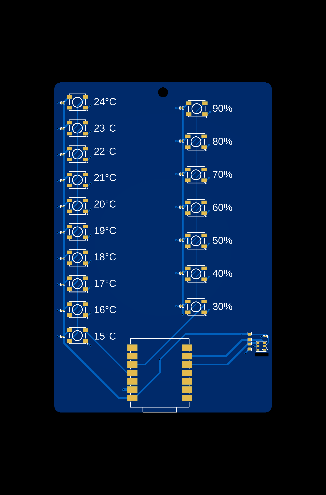
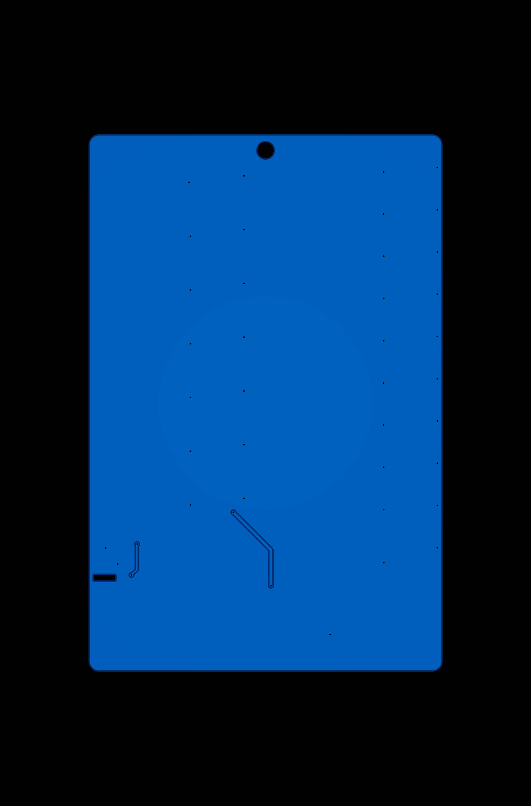
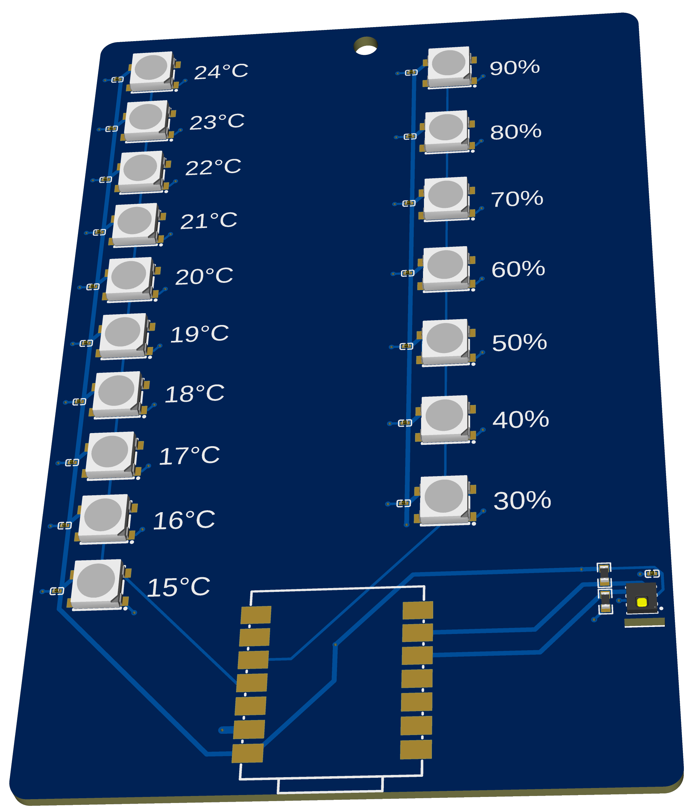

# NeoPixel Themometer

## Wokwi link

Wokwi link: <https://wokwi.com/projects/428115663410135041>

Note that Wikwi doesn't support any I2C temperature sensors like the AHT20 module I am using, so I have written placeholder functions that return random dummy data for the Wokwi simulation. Naturally, this would be replaced by code that reads actual temperature/humidity data from the sensor. I have written some code using the [SparkFun AHT20](https://github.com/sparkfun/SparkFun_Qwiic_Humidity_AHT20_Arduino_Library) library below, although this has not been tested.

### Code to be added for AHT20 support

```ino
#include <Wire.h>
#include <SparkFun_Qwiic_Humidity_AHT20.h>
```

```ino
AHT20 sensor;
```

```ino
float getTemperature() {
  return sensor.getTemperature();
}
```

```ino
float getHumidity() {
  return sensor.getHumidity();
}
```

In `setup()`:

```ino
Wire.begin();
if (sensor.begin()) {
  Serial.println("Found AHT20 sensor")
} else {
  Serial.println("Fatal error: AHT20 not found")
  while (1);
}
```

## About

Digital thermometers with numerical displays are boring! So, I made a temperature (and humidity!) sensing device powered by RGB NeoPixel LEDs. It uses an AHT20 temperature & humidity sensor to sense how hot, cold, or humid it is, then displays the temperature using a 10-LED colored gradient, and the humitity using a 7-LED scale.

It's designed to work with temperatures from 15°C to 25°C (i.e. normal room temperature ranges for the UK), and relative humidity values from 30% to 100%. This could be changed by tweaking the silkscren text and the software, though.

## Bill of materials

<!-- TODO: A simplified BOM table
(include rough pricing of any extra components you're using)

Example:

| Comment           | Footprint                                      | Quantity | LCSC     | Cost   |
|-------------------|------------------------------------------------|----------|----------|--------|
| 100uF             | C_1206_3216Metric_Pad1.33x1.80mm_HandSolder    | 1        | C15008   | 0.0682$|
| 4.7nF             | C_0402_1005Metric_Pad0.74x0.62mm_HandSolder    | 3        | C1538    | 0.0011$|
| WS2812B           | LED_WS2812B_PLCC4_5.0x5.0mm_P3.2mm             | 9        |          |
| XIAO-RP2040-DIP   | XIAO-RP2040-DIP                                | 1        |          |
| Cherry MX         | SW_Cherry_MX_1.00u_PCB                         | 2        |          | 6.48$ for 8, 1.62$ for 2 |
 -->

| Comment         | Footprint                               | Quantity | LCSC Part     | Cost       |
| --------------- | --------------------------------------- | -------- | ------------- | ---------- |
| 10kΩ            | R0603                                   | 2        | C3017715      | $0.01      |
| 100nF           | C0201                                   | 18       | C14663        | $0.20      |
| AHT20           | SENSOR-SMD_L3.0-W3.0-P1.00-BR           | 1        | C2757850      | $0.71      |
| WS2812B-5050RGB | LED-SMD_4P-L5.0-W5.0-BR_WS2812B-5050RGB | 17       | C114586       | $1.64      |

| Comment         | Footprint                               | Quantity | JLCPCB Part    | Cost           |
| --------------- | --------------------------------------- | -------- | -------------- | -------------- |
| XIAO ESP32C3    | COMM-SMD_KQ-2801_V106                   | 1        | [C19189385][1] | $11.70 (for 3) |

[1]: <https://jlcpcb.com/partdetail/Seeed-XIAOESP32C3/C19189385>

## Design process

<!-- Tell us a little bit about your design process. What were some challenges? What helped? -->

Once I had the idea for the project, I made a simple [mockup of the LED layout](https://www.tldraw.com/f/wIqEhbxRnkui7VBJU_q1x?d=v330.1.2188.1465.YdsrRqgbpH172HVnukqYR) in tldraw.

This was my first time designing a PCB, and I chose to use [EasyEDA Pro](https://pro.easyeda.com/) to design the schematic and PCB. I read through some of the PCB Hack Club Jams to learn how to do PCB things - I foudn the [SparkleTilt jam](https://jams.hackclub.com/batch/sparkletilt-pcb/part-1) to be incredibly helpful.

I went through 3 stages of ovecomplicating and then simplifying:

If I could, I'd have given some advice to my past self:

- Properly think about where you'd want the componenets on the real thing when you're making the schematic, because it makes creating the PCB way easier
  - I did this to an extent, but I failed to consider that I'd want the Xiao's USB port at the bottom of the board, and making that change meant that I had to flip quite a few components around.
- Read _all_ of the Pixeldust guide, to learn that I don't need a decoupling capacitor for _every single NeoPixel_
  - My design included a capacitor for every NeoPixel, and I now realise that that's not required. (But it's too late to update the design now!)
  - Alternatively, talk to my friend who knows about PCBs earlier, because he spotted the issue too.
- Use the cheaper, more common 0402 package size for capacitors, instead of the default tiny 0201 capacitor size that EasyEDA gives you

## Images

<!-- Some images of your design (make sure to include both the PCB and Schematic!): -->

### Mockup



### Electronic schematic



### PCB design



### 2D render





### 3D render


