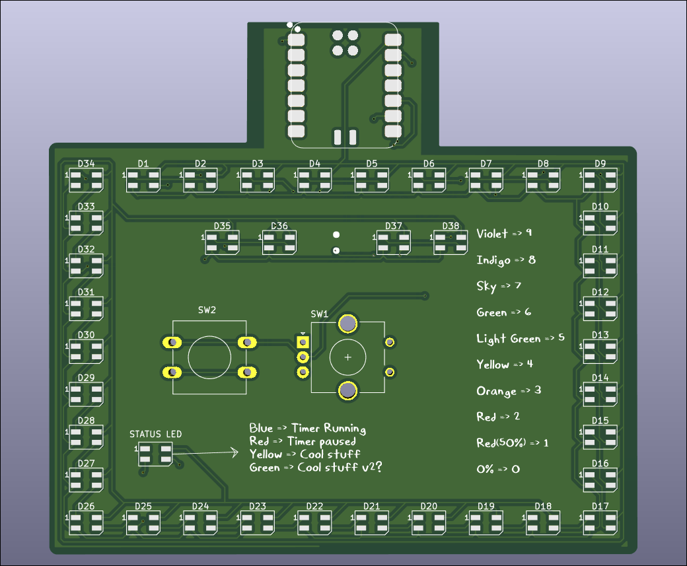
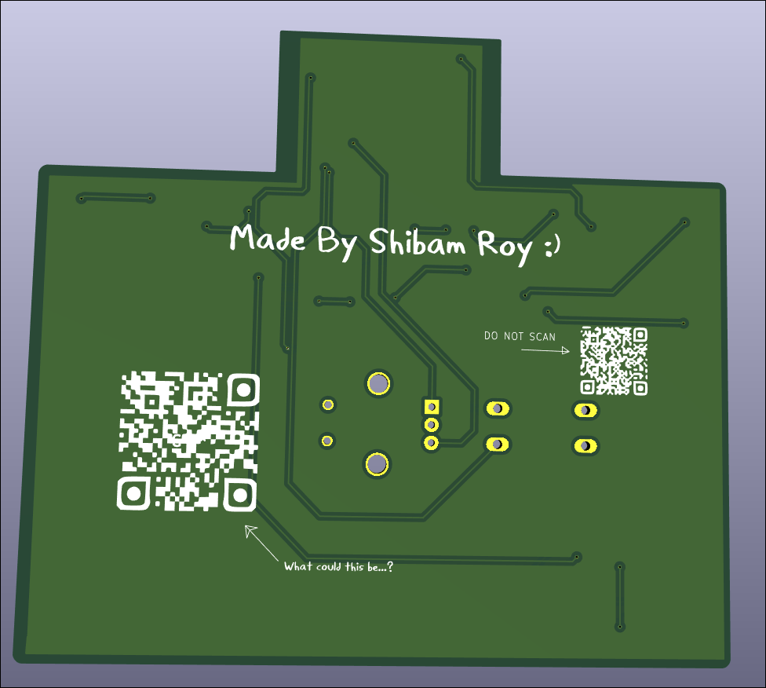
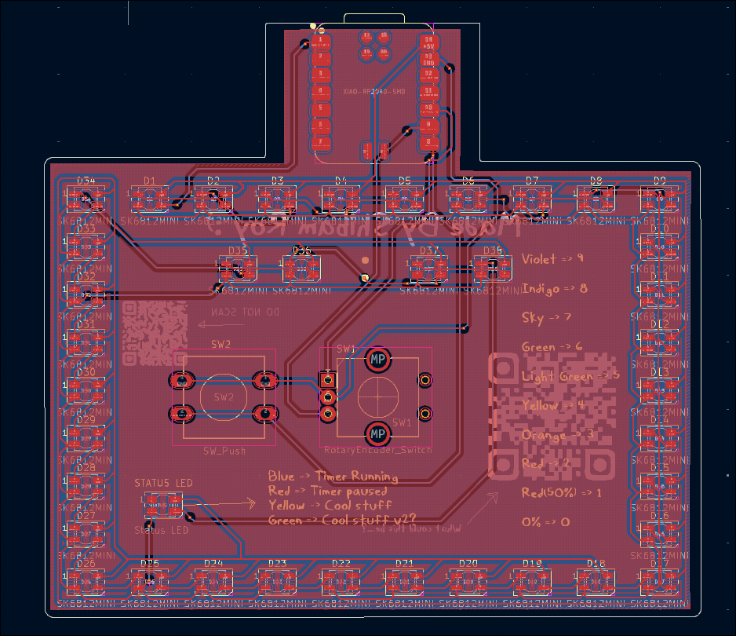
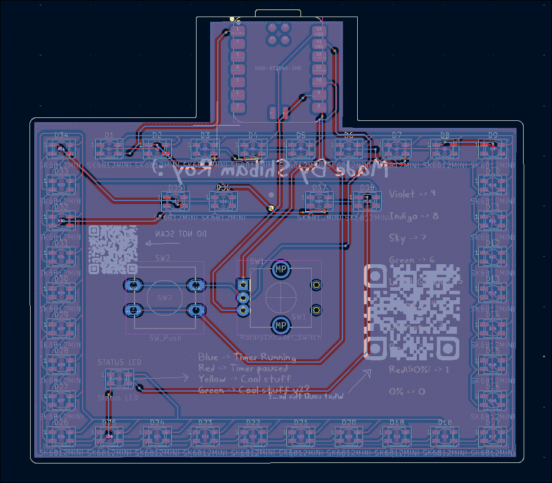
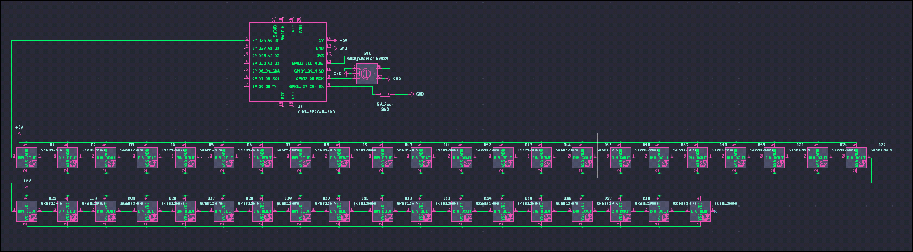

# PixelDoro

Wokwi link: [https://wokwi.com/projects/427326949815743489](https://wokwi.com/projects/427326949815743489)
Github link: [https://github.com/ShibamRoy9826/PixelDoro](https://github.com/ShibamRoy9826/PixelDoro)

A pomodoro clock kind of thing made out of neopixels!
The numbers are represented as colors in the clock.

It also comes with 2 other cool modes, like:

- Random Mode : When enabled, it randomly lights up neopixels with random colors
- RGB Mode: It cycles through all the colors one by one!

## Screenshots

> ![NOTE]
> Hmm.... are you actually going to scan them..?

## BOM

| Name | Quantity | Price(in USD) | Total(in USD) | Link |
| :--- | :--- | :--- | :--- | :--- |
| SK6812-MINI Leds | x 39 | 0.38 | 14.44 | [here](https://www.lcsc.com/product-detail/Light-Emitting-Diodes-LED_OPSCO-Optoelectronics-SK6812MINI-E_C5149201.html) |
| XIAO RP-2040 SMD | x 1 | 6.49 | 6.49 | [here](https://robu.in/product/seeed-studio-xiao-rp2040-v1-0/) |
| Alps EC11-E Vertical H20mm Circular mount | x1 | 0.5 | 0.5 | [here](https://robu.in/product/hongyan-ec11h-7ce15p1zy15f7-rotary-encoder-with-push-button-switch-vertical-plug-in/?gad_source=1) |
| 12mm push button | x1 | 0.29 | 0.29 | [here](https://www.amazon.in/Push-Button-Tactile-Micro-Switch/dp/B08P5D5658) |
| PCB | x5(minimum) | 2+1.5(shipping) | 3.5 | [here](https://jlcpcb.com/) |

## Difficulties

I didn't feel any major difficulty except for the firmware, I was really confused on how to write code for a rotary encoder, or with a push button. After doing some research I found projects which included them and I learned how I could integrate them into my project!
It didn't run in wokwi for a long time without errors, and when it finally did, It felt amazing!

