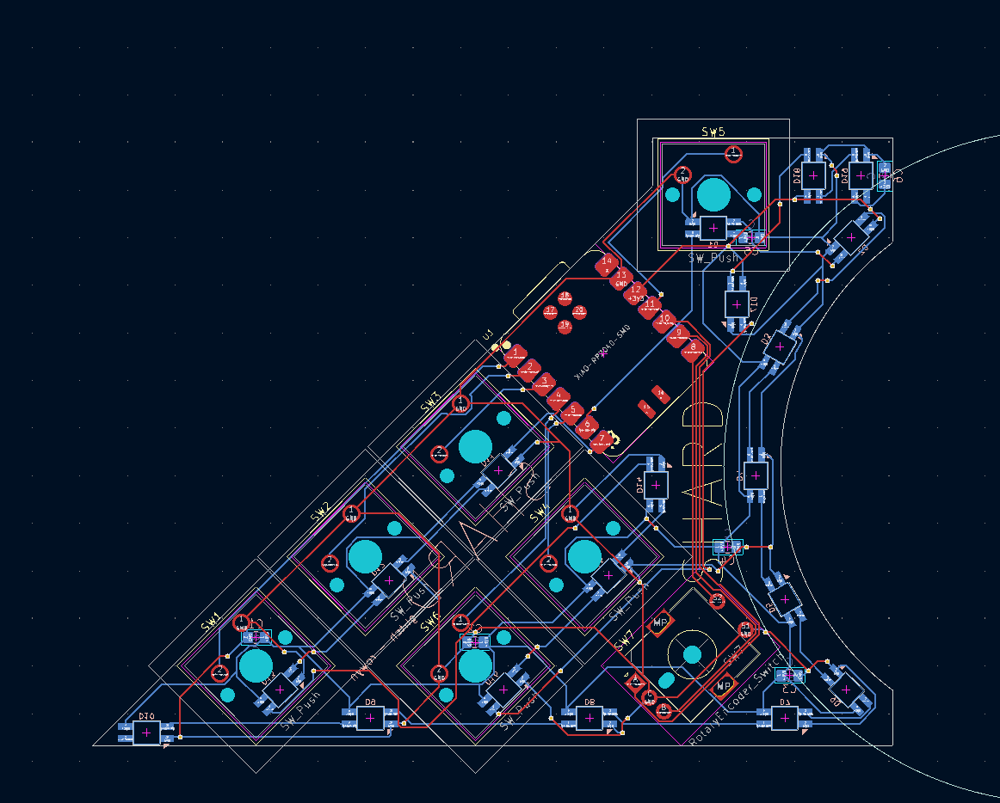
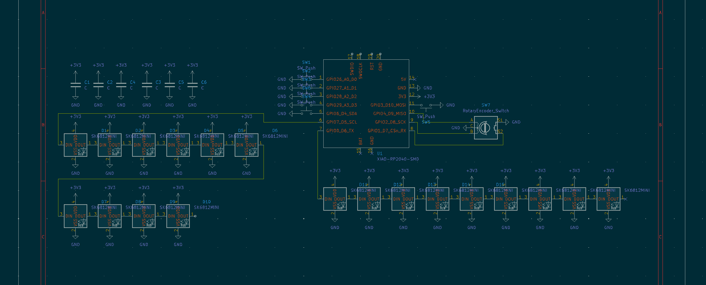

# Shard

Replace the wokwi link below with yours

Wokwi link: [https://wokwi.com/projects/428219055605758977](https://wokwi.com/projects/428219055605758977)

<!-- Uncomment the line below if you need a soldering iron -->
⚠️ I would like to assemble the other boards other than the one that comes preassembled, so I would be very interested in the hot plate you were talking about.

Describe your board in 2-3 sentences. What are you making? What will it do? Please add a lot of pictures here!!

This is a controller that fits to the left side of a 3dconnexion spacemouse, allowing you to have 6 keys and an encoder where you fingers usually rest on the table. This reduces the amount you have to move between the keyboard and spacemouse.

A simplified BOM table
(pls include rough pricing of any extra components you're using)

<!-- Example: -->

| Comment           | Footprint                                      | Quantity | LCSC     | Cost   |
|-------------------|------------------------------------------------|----------|----------|--------|
| 100uF             | C_0805_2012Metric_Pad1.18x1.45mm_HandSolder    | 1        | C141660   | |
| EC11              | RotaryEncoder_Alps_EC11E-Switch_Vertical_H20mm_MountingHoles | 3        |   C370970  | 2.0986|
| SK6812MINI-E      | SK6812MINI-E                                   | 19       |    C5149201      |0.0748
| XIAO-RP2040-DIP   | XIAO-RP2040-DIP                                | 1        |          |
| Cherry MX         | SW_Cherry_MX_1.00u_PCB                         | 2        |          | 6.48$ for 8, 1.62$ for 2 |

Tell us a little bit about your design process. What were some challenges? What helped?

Everything was pretty straightforward after hackpad, I just got stuck starting the code as I have been very busy and not had time to get into it.

Some images of your design (make sure to include both the PCB and Schematic!):

