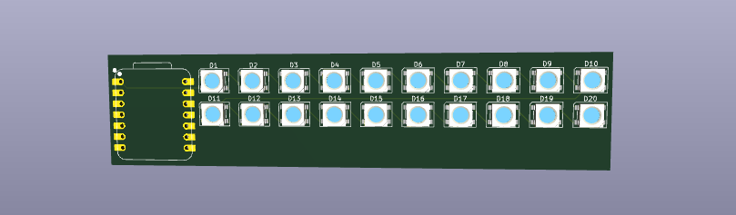
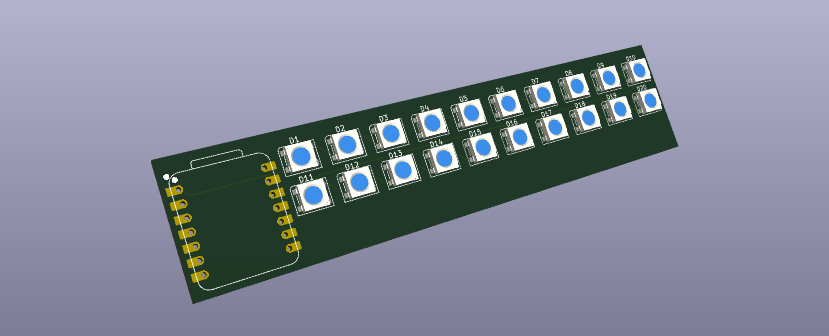

# Statusbar

Wokwi link: [https://wokwi.com/projects/426786875779427329](https://wokwi.com/projects/426786875779427329)

My board is a statusbar / multi-functional appliance, it is primarily software based for control and is setup so it can easily show the progress you have on an application or be used to display other information.

A simplified BOM table ( detailed one is included in the repo ):
"SK6812","20",
"XIAO-RP2040-DIP","1",

When designing my PCB I had a few goals in mind:
* Useable, I want it to be stylish but something I will actually use.
* Multi-functinal, I needed it to be used for a variety of actions, such as a Statusbar or for LED displays for whatever purpose.
* Case, it should be able to fit in a case I can design.

I ended up designing this schematic, due to it being software based I didn't need it to have any extra controls, such as buttons:

I had issues with Kicad crashing a lot, it has a ton of memory leaks, but I was able to design and sketch the PCB in the shape I actually wanted:

Here is what the final result looked like!:

The next thing I had was software design and testing. I went through a bunch of libraries and found the adafruit neopixel which is what I decided to stick with.

I had a ton of issues with only one turning on, or none working and I spent hours debugging. I then redid how it was wired in Wokwi ( the simulator ) and it started working. It turns out because all the wires just merge together a few were off and it messed up the entire thing.
