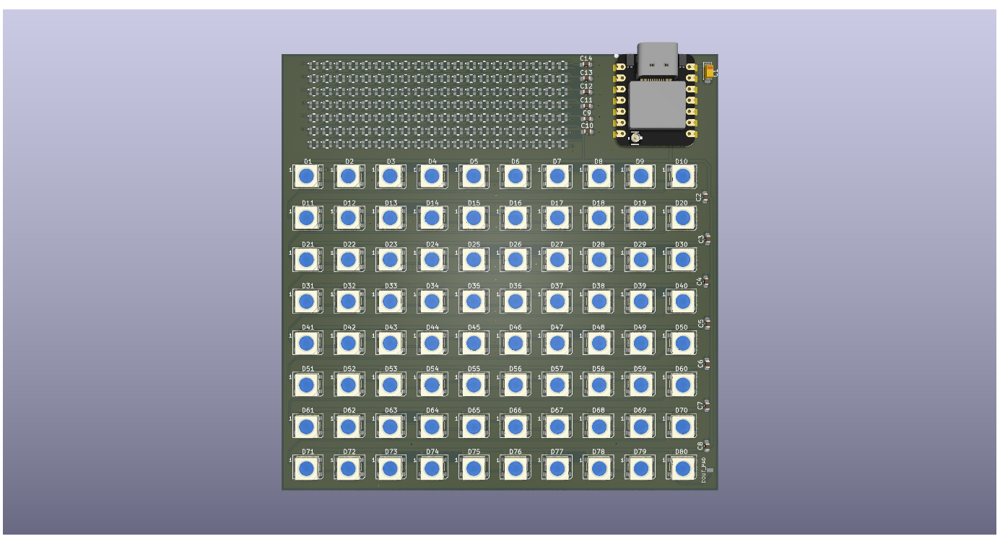

# ZeDisplay

<!-- Uncomment the line below if you need a soldering iron -->
<!-- ⚠️ I would like to [reason for iron], so I would need a soldering iron. -->

A dual neopixel display with 5050 RGB LEDs and SMD-4P,2x1.8mm RGB LEDs for elegant viewing. The display is powered by a XIAO ESP32-S3 microcontroller, and uses micropython. The display is designed to be used as a decorative element in a room or as a fun project for electronics enthusiasts :)

A simplified BOM table
(pls include rough pricing of any extra components you're using)

<!-- Example: -->

| Comment           | Footprint                                      | Quantity | LCSC     | Cost   |
|-------------------|------------------------------------------------|----------|----------|--------|
| 1uF               | C_1206_3216Metric_Pad1.33x1.80mm_HandSolder    | 1        | C15008   | 0.1247$|
| 1nF               | C_0402_1005Metric_Pad0.74x0.62mm_HandSolder    | 13       | C100040  | 0.0273$|
| WS2812B           | LED_WS2812B_PLCC4_5.0x5.0mm_P3.2mm             | 80       | C22461793| 1.94$  |
| WS2812B           | XINGLIGHT XL-0807RGBC-WS2812B-S                | 140      | C41413181| 3.65$  |
| XIAO ESP32-S3     | XIAO-ESP32-S3-DIP                              | 1        |          |        |

This was more hectic to design than i imagined it to be. The power delivery was problematic, I had planned of using
USB C PD but the neotiating circuit was too complex. Not thinking about it definetly helped, I just ended up using the XIAO's 
already established power from the USB C port (implicit contract, 5V3A).

some images:

> The slikscreen has designs from the XKCD comics. <3