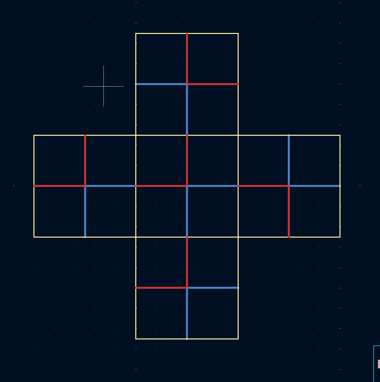
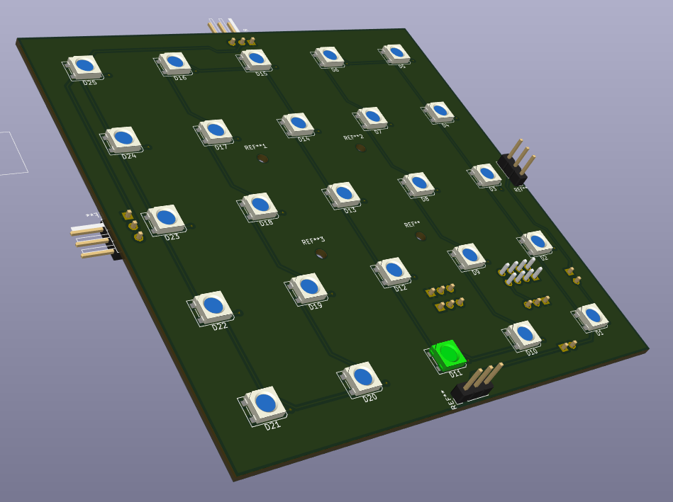
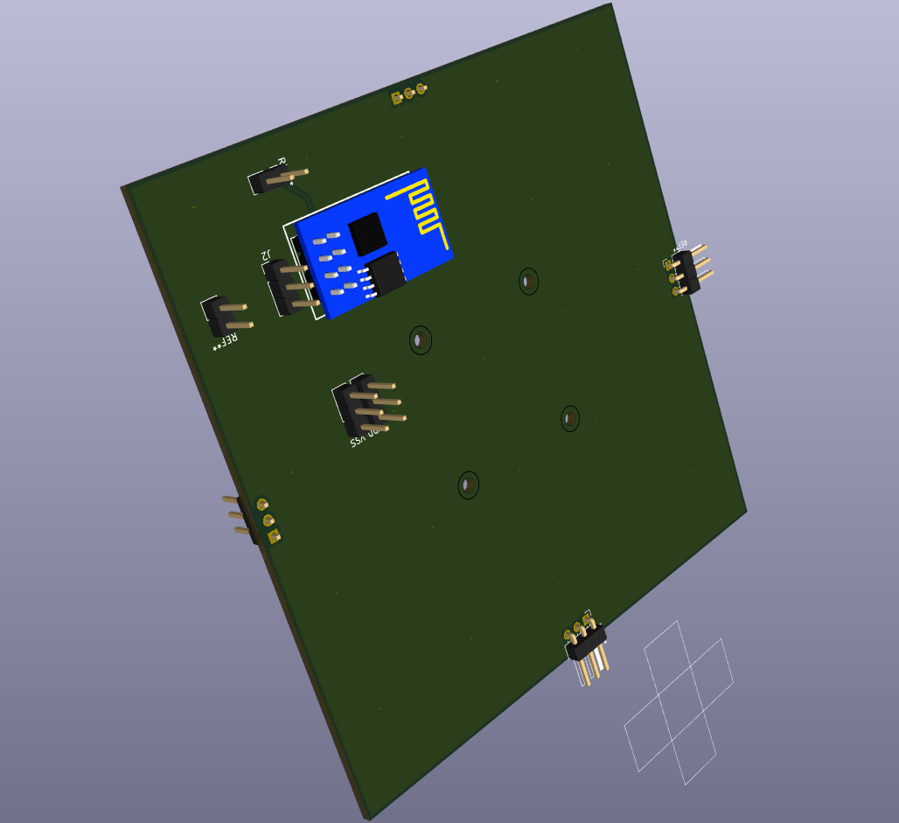
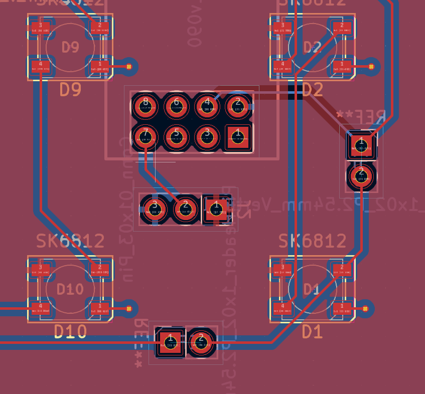
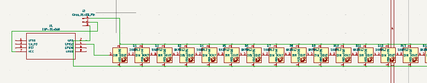
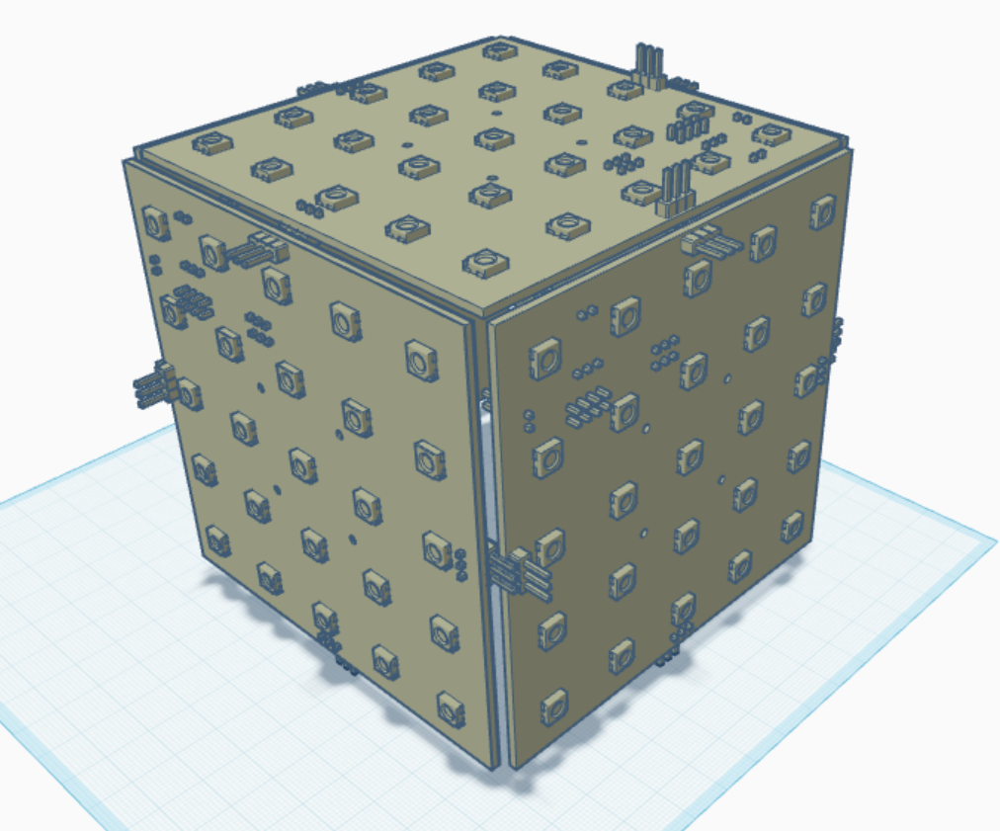

# boombox

Replace the wokwi link below with yours

Wokwi link: [https://wokwi.com/projects/428017058956591105](https://wokwi.com/projects/428017058956591105)

<!-- Uncomment the line below if you need a soldering iron -->
⚠️ I don't want to solder my neopixels, but since I am above the 50 limit, I would need ONLY soldering assesories if possible, as I already have an iron. 

Boombox intends to make use of the minimum of 5 pcbs printed by JLCPCB by ensuring the design can be fit together to form one large board, in this case the shape of a box. It is intended to be hung and be used as an audio visualizer under OpenRGB using the E1.31 protocol.

A simplified BOM table
(pls include rough pricing of any extra components you're using)

<!-- Example: -->

| Comment           | Footprint                                      | Quantity | LCSC     | Cost   |
|-------------------|------------------------------------------------|----------|----------|--------|
| SK6812            | LED_SK6812_PLCC4_5.0x5.0mm_P3.2mm              | 130      |          |        |
| 90Deg Pin Header  | PinHeader_1x03_P2.54mm_Horizontal              | 10       | C92159   | $0.37  |
| Pin Header        | PinHeader_1x0N_P2.54mm_Vertical                | 50       |  Any combination to make 10x 3pin and 10x 2pin
| 5v to 3.3v        | PinHeader_1x03_P2.54mm_Vertical                | 1        |  3 Pins AMS1117| 0.72 for 5   |
| 2x4 Female Pin H. |                                                | 1x       | C41427526| $1.36  |

Tell us a little bit about your design process. What were some challenges? What helped?

I wanted to make a room scale audio visualizer, and needed the maximum PCB area to make it effective, as well as varying directions for the leds. The square design is optimal and easy to make.

It works by exposing two pin headers to disconnect either of the blue wires in the schematic below
This allows me to connect a path across the cube's faces for the data pins. Power is distributed throughout through ground fills on both sides of each face.

Finally, the whole thing will be controlled by a ESP-01 powered from the voltage step down. It will run a E1.31 server to recieve lighting instructions from OpenRGB.

The tiny 7-neopixel circle I have already is bright and crisp, I can only imagine how epic the final product will be.

