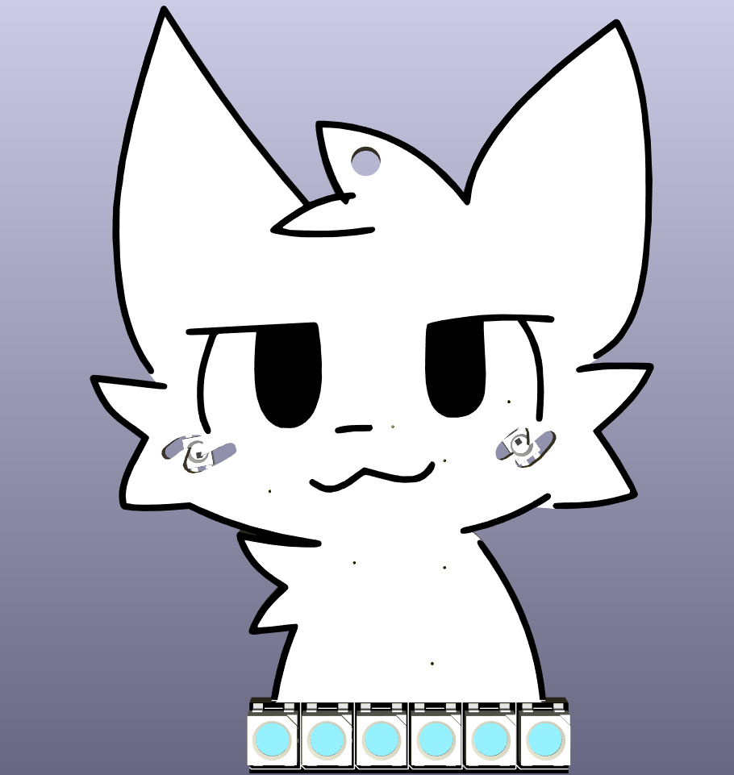
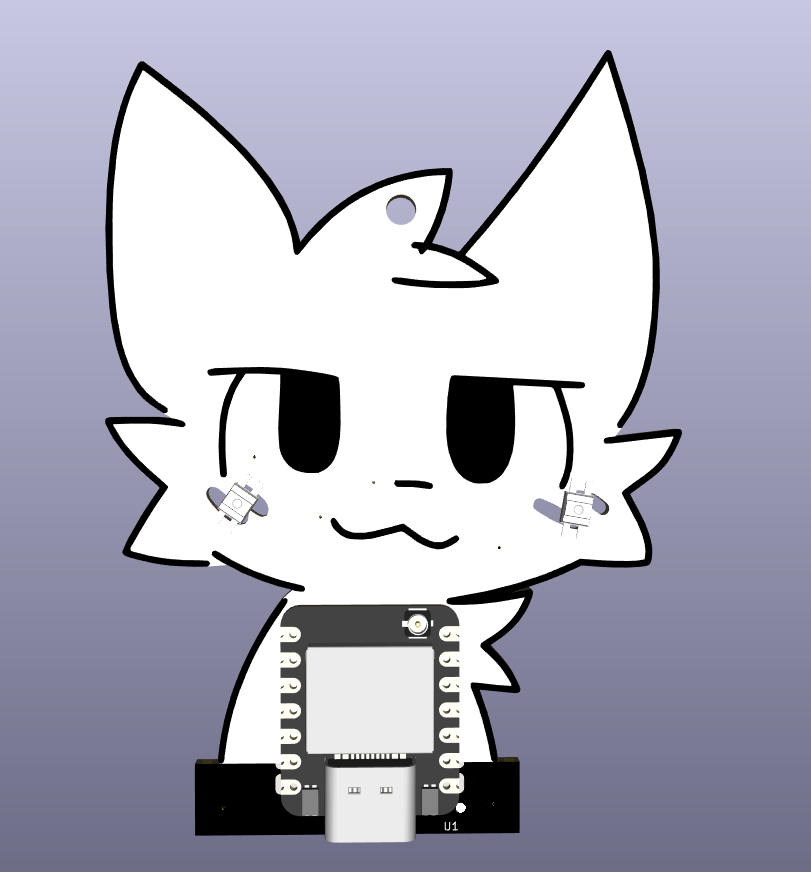
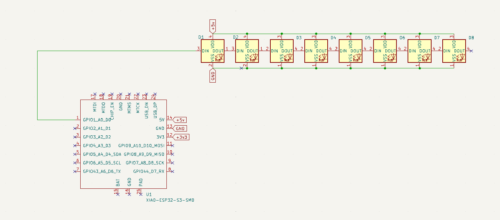
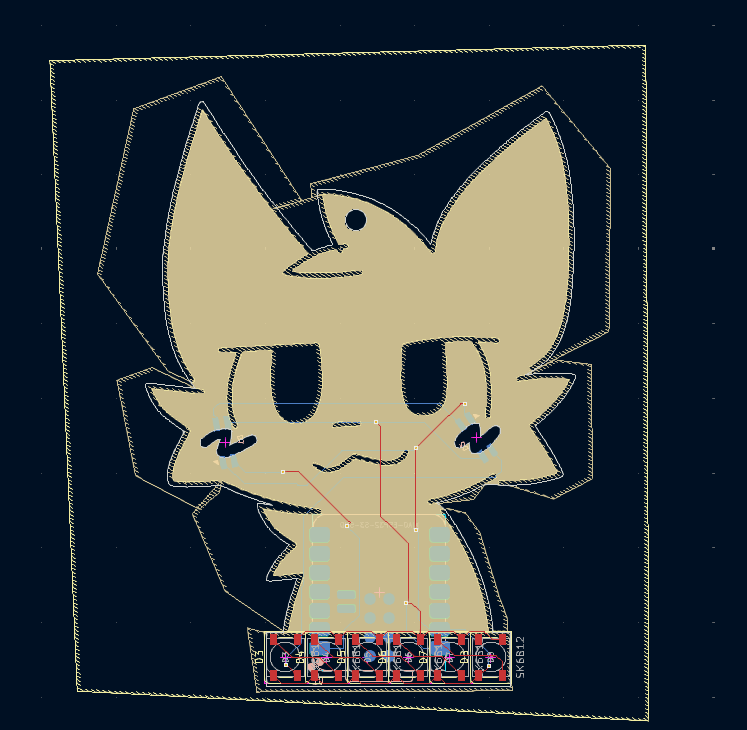

# Boykisser keychain

Wokwi link: [https://wokwi.com/projects/428126154408852481](https://wokwi.com/projects/428126154408852481)

This is mauzymice's boykisser on a PCB keychain with addressable RGB leds. This is just for fun and has no actual use (apart from attracting furries, of course) and I plan to add bluetooth support when I have more time. The current code is extremely simple, there's 4 colour profiles that gets cycled when the boot button on the Seeed Xiao esp32-s3 is pressed. To fill in the gap and diffuse the LED behind the "blush", I plan to add either hot glue or silicone. I might add a small boost converter and a lithium battery charging module as well to power the keychain wirelessly.

Critical specifications in JLCPCB:
1. PCB Color must be Black
2. "Remove Mark" option must be selected under High-spec Options > Mark on PCB

Note:
Yes, some of the SK6812Mini-EA pads will be cut off and this should be fine

Bill Of Material

| Comment           | Footprint                                      | Quantity | LCSC     | Cost   |
|-------------------|------------------------------------------------|----------|----------|--------|
| SK6812-5050       | C_1206_3216Metric_Pad1.33x1.80mm_HandSolder    | 6        | -     |  -   |
| SK6812MINI-EA     | C_0402_1005Metric_Pad0.74x0.62mm_HandSolder    | 2        | -     |  -   |
| XIAO ESP32-S3     | XIAO-RP2040-DIP                                | 1        | -     |  -   |

Initially, I wanted to take a shortcut by finding an image online and using KiCad's image converter to create the edge cuts. However, I quickly realized that this method wouldn't work as it gave broken and jagged edge cuts. Then, I decided to design the edge cuts and rule zone manually by tracing over the original image (real). It took about 2 hours to design the PCB without any components.

Once the base PCB outline was complete, I spent the next hour picking and placing the components. After that, I've spent another hour and a half to writing a simple Arduino sketch that cycles through four different color profiles with each press of the boot button. To validate the design, I wired everything up in the Wokwi simulator. Initially, the circuit didn’t work as the LEDs to the same pin as the USB line. It took me a longer time that I'd like to admit to find the problem. With that done, I quickly fixed the code and updated the PCB routing.

