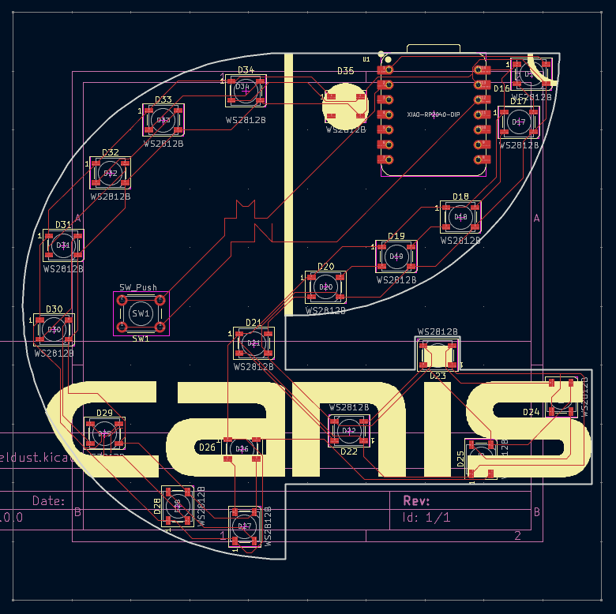
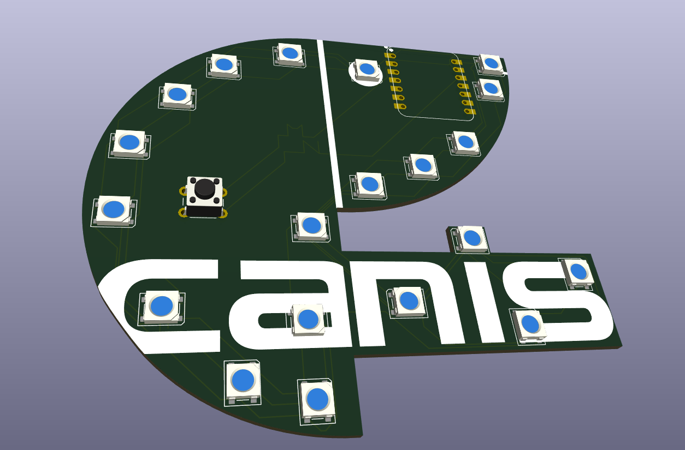

## Submission for pixeldust: canis_led

Canis is one of my long-time AI projects. This trinket is basically the logo in a pcb shape with 20 Neopixel LEDs on it. 

Board-Name: canis_led (files in PCB folder)

Slack-id: U079RRXRMPF

wokwi-link: https://wokwi.com/projects/426525477583739905 (firmware in software folder)

