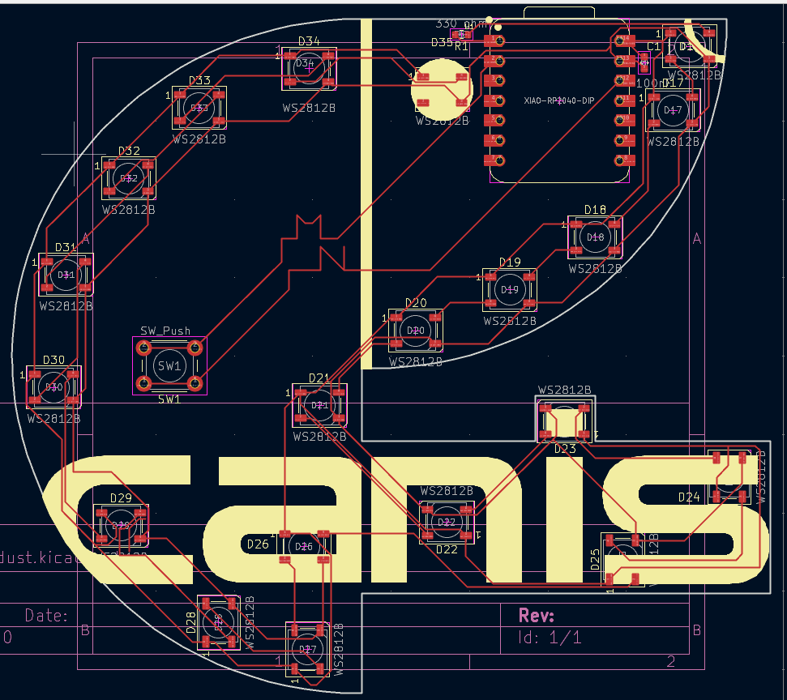

--- 
name: "Marko Nedilko"
slack_id: "U079RRXRMPF"
github_handle: "@crasyK"
wokwi: https://wokwi.com/projects/426525477583739905
---

# Canis_led

Wokwi link: [https://wokwi.com/projects/426525477583739905](https://wokwi.com/projects/426525477583739905)

Canis is one of my long-time AI projects. This trinket is basically the logo in a pcb shape with 20 Neopixel LEDs on it. 

A simplified BOM table

| Comment           | Footprint                                      | Quantity |
|-------------------|------------------------------------------------|----------|
| 100nF             | Capacitor_SMD:C_0603_1608Metric                | 1        | 
| 330ohm            | Resistor_SMD:R_0603_1608Metric                 | 1        | 
| WS2812B           | LED_SMD:LED_WS2812B_PLCC4_5.0x5.0mm_P3.2mm     | 20       |         
| XIAO-RP2040-DIP   | XIAO-RP2040-DIP                                | 1        |       
| SW_Button         | Button_Switch_THT:SW_PUSH_6mm_H5mm             | 1        |       

Tell us a little bit about your design process. What were some challenges? What helped?
    I started with the SVG of my Logo and then added the LEDs so its like a windmill orientation like you see on those RGB PC fans. And then the schematic and routing and Done! Guidelines on the Website were very helpful!!

