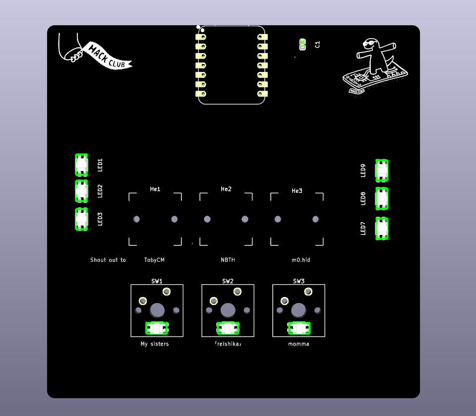

# PixelPad

Replace the wokwi link below with yours

Wokwi link: https://wokwi.com/projects/428194723515552769

<!-- Uncomment the line below if you need a soldering iron -->
<!-- ⚠️ I would like to [reason for iron], so I would need a soldering iron. -->

<!-- Example: -->

| Comment           | Footprint                                      | Quantity | LCSC     | Cost   |
|-------------------|------------------------------------------------|----------|----------|--------|
| 100nF             | CL10B224KA8NNNC                                | 1        | C21120   | 0.0682$|
| WS2812B           | SK6812MINI-EA                                  | 9        | C5378731 |        |
| XIAO-RP2040-DIP   | XIAO-RP2040-DIP                                | 1        |          |        |
| Cherry MX         | SW_Cherry_MX_1.00u_PCB                         | 3        |          | 1.3$ for 3 |
| Hall Effect Sensor| GH39FKSW                                       | 3        | C266230  | $0.1439|

Tell us a little bit about your design process. What were some challenges? What helped?

originally i wanna design like  a 10x10 pixel board so i can display like image,qr,.. on it but i shuddenly have some idea about making  a keypad!
there was not a lot of challenge cuz @tobycm helped me a lot with kicad!(hes the goat 🗣). 

Some images of your design (make sure to include both the PCB and Schematic!):

