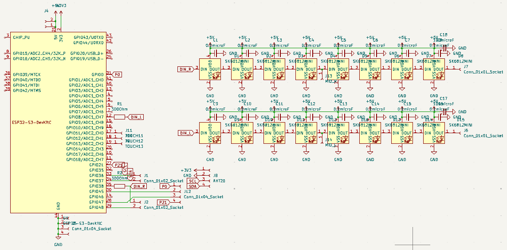
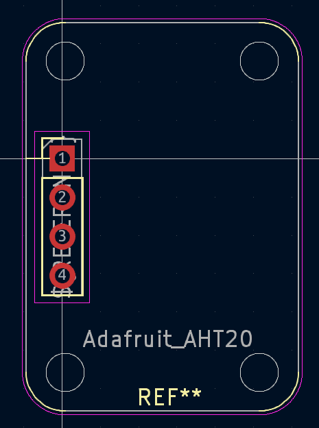
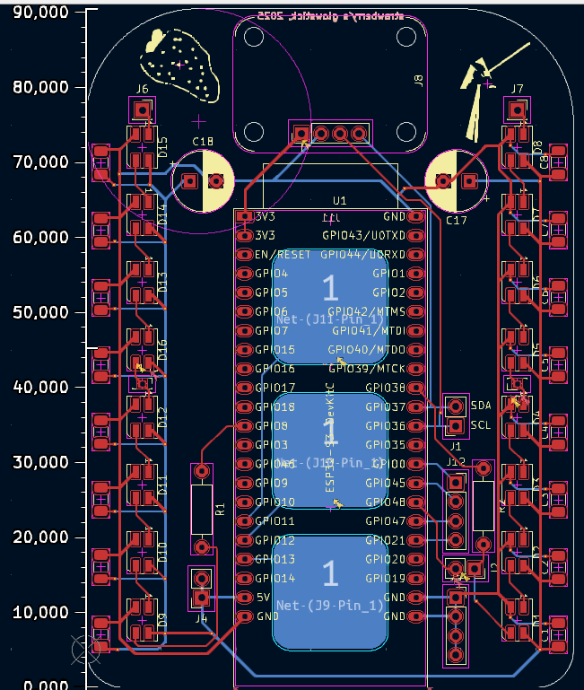
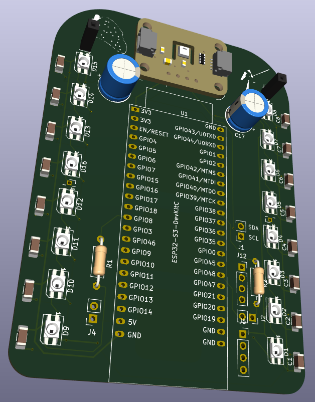

# Glowpad

Wokwi link: [https://wokwi.com/projects/428760578626492417](https://wokwi.com/projects/428760578626492417)
firmware changed a bit (only neopixel pins+test values i think) to account for RPi pico simulation

<!-- Uncomment the line below if you need a soldering iron -->
⚠️ I would like to solder the caps and some neopixels (not all tho, maybe 3/16, so I would need a hotplate (as per Slack)

## About

This is a glowstick/glowpad PCB that shows the current temperature and humidity. It has one 8-neopixel "bar" on each side of the PCB, with the S3-DevkitC in the middle. I didn´t want this to be similar to normal thermometers (digital or physical), so the humidity is shown by bars rising, and temperature is shown with neopixel color.

A simplified BOM table
(pls include rough pricing of any extra components you're using)

<!-- Example: -->

| Comment           | Footprint                                      | Quantity | LCSC     | Cost   |
|-------------------|------------------------------------------------|----------|----------|--------|
| 100uF/330F             | CP_Radial_D8.0mm_P3.50mm    | 2        | C112510/C383041   | 0.033$/0.036$ | 
| 0.1nF             | C_1206_3216Metric_Pad1.33x1.80mm_HandSolder    | 16        | C24497    | 0.014$|
| SK6812MINI-E           | LED_SK6812MINI_PLCC4_3.5x3.5mm_P1.75mm             | 16        |          |
| ESP32-S3-DevkitC   | ESP32-S3-DevkitC                                | 1        | [allegro, N8R8 i think](https://allegro.cz/nabidka/modul-esp32-s3-devkitc-1-wroom-1-n16r8-16mb-flash-wifi-bluetooth-usb-c-17303767653)          | 13+2$ | |Adafruit AHT20 board         | Adafruit_AHT20                         | 1        | [Botland.cz](https://botland.cz/multifunkcni-senzory/17199-aht20-snimac-teploty-a-vlhkosti-i2c-adafruit-4566-5904422364311.html)         | 6$+4$ shipping |
| 300Ohm            | R_Axial_DIN0207_L6.3mm_D2.5mm_P10.16mm_Horizontal | 2       |          |       | 

## Design

I started out with a perhaps unoriginal goal of a 8x8 neopixel matrix, because everyone loves displaying things! Knowing that the MCU can´t give more than 500mA (and wanting to use my matrix at more than 1/10 brightness :P ), I checked the allowed parts list to see how I can get those 4A for a blinding fullbright matrix, so I put an USBC receptacle, PD controller and a buck converter in my schematic. I spent multiple days painfully trying to get info about the intended schematics for those components (apparently, a 5V converter isn´t just "ground goes here, bad voltage goes in here, 5V goes out here", who knew?).
When i realised that i´m actually behind on time because of this research, I hurried to make a PCB... only to see that the footprints for these things scream "DRC violation" and cannot be soldered by a human. I decided i don´t want to bother with them anymore and shelved the design (maybe i´ll use onboard+PCBA for it).
Starting with a clean slate, the AHT20 sensor in the component list caught my eye, because i like things that interact with the environment. I decided to make a thermometer-like board, and since most thermometers are long and thin and it was 1AM, I went with the S3 DevkitC, because "it has a similar shape" (this made my board into a not-so-thin Glowpad instead of a Glowstick). After making an Adafruit AHT20 board footprint myself because i couldn´t find it anywhere, I made the PCB, added a lot of needlesly broken out pins as always, and made the thermometer firmware.

## Images

### Schematic

### [AHT20 footprint](src/custom_footprints_Adafruit_AHT20.kicad_mod)

### PCB

### Wokwi (RPi pico)

### 3D renders

