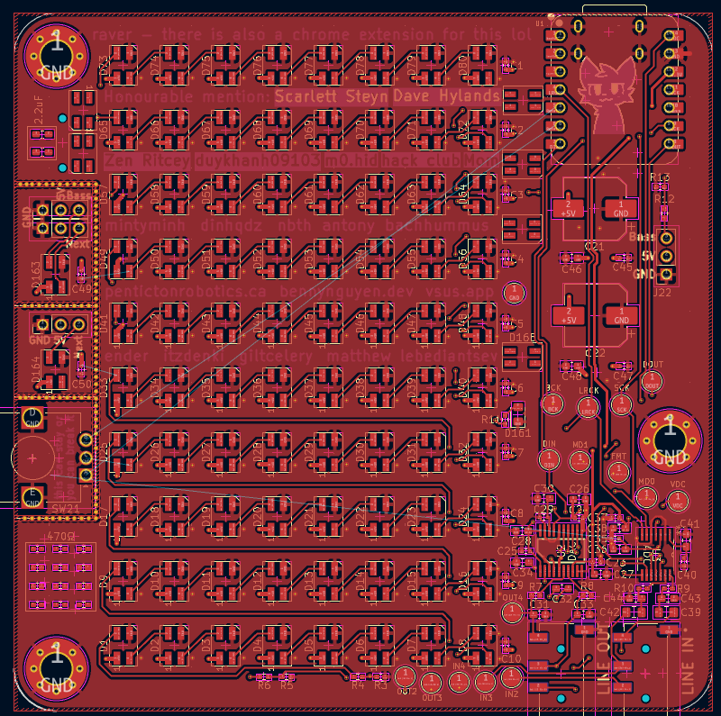
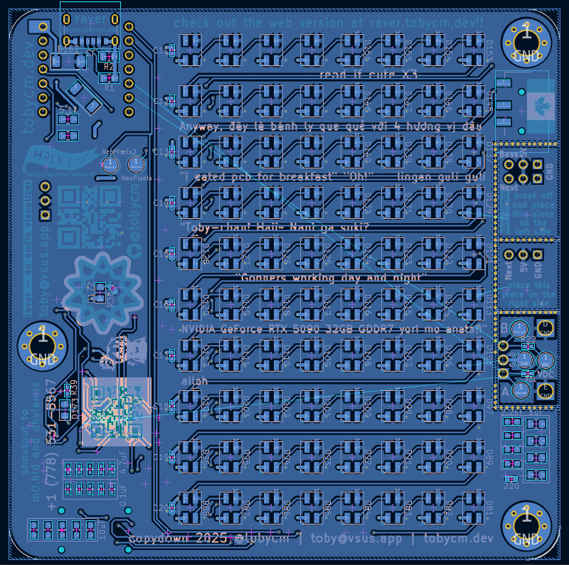
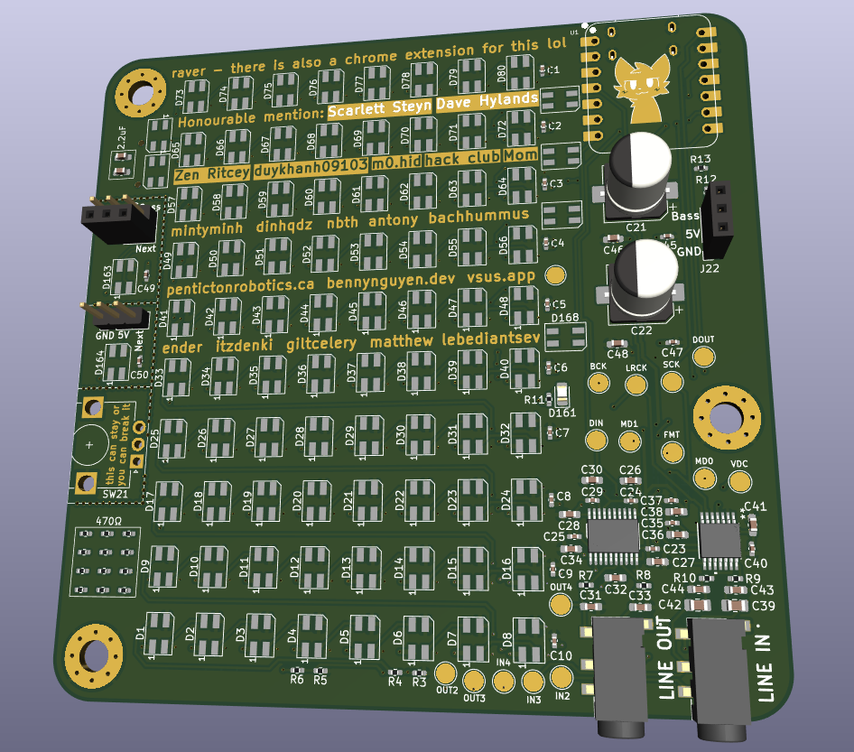
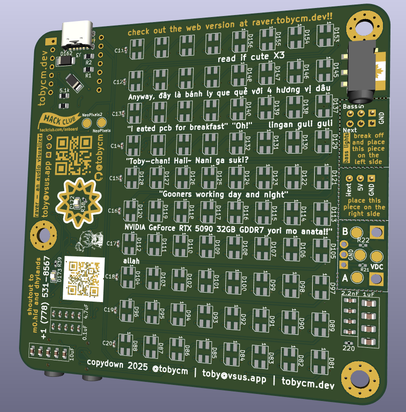

# Raver

Wokwi link: [https://wokwi.com/projects/426625186184011777](https://wokwi.com/projects/426625186184011777)

I made an audio visualizer using JavaScript at [raver.tobycm.dev](https://raver.tobycm.dev), made it into a Chrome extension as well. This will be the sequel to the 2 digital version by having a physical audio visualizer lol.

BOM table:

| Part                        | Quantity | LCSC      | Cost     |
| --------------------------- | -------- | --------- | -------- |
| 4.7uF                       | 27       | C23733    | 0.1458$  |
| 1mF                         | 2        | C5246577  | 0.1456$  |
| 0.1uF                       | 14       | C1525     | 0.0168$  |
| 10uF                        | 14       | C19702    | 0.0840$  |
| 2.2nF                       | 8        | C1604     | 0.0216$  |
| 2.2uF                       | 4        | C23630    | 0.0236$  |
| 1uF                         | 6        | C28323    | 0.0564$  |
| SK6812MINI-HS               | 168      | C2922787  | 17.0688$ |
| Green LED                   | 3        | C2297     | 0.0324$  |
| Schottky Diode              | 2        | C509930   | 0.4398$  |
| PJ-320D-A Headphone Jack    | 3        | C19189088 | 0.1518$  |
| USB-C Receptacle            | 1        | C2927029  | 0.0363$  |
| Pin Header 2.54mm           | 6 pins   |           |          |
| Pin Socket 2.54mm           | 6 pins   |           |          |
| 5.1kΩ                       | 4        | C25905    | 0.0020$  |
| 10kΩ                        | 3        | C25744    | 0.0018$  |
| 470Ω                        | 19       | C25117    | 0.0114$  |
| 220Ω                        | 4        | C25091    | 0.0024$  |
| Rotary Encoder EC12E24404A9 | 1        | C2687299  | 0.4979$  |
| XIAO-RP2040-DIP             | 1        |           |          |

<!-- Tell us a little bit about your design process. What were some challenges? What helped?

Some images of your design (make sure to include both the PCB and Schematic!): -->

I am very lucky to have @dhylands as my mentor throughout the designing process: giving me valuable tips like using test points, make [test boards for subsystems](https://github.com/tobycm/OnBoard/tree/main/projects/tobydio) to test them if they actually work, and general schematic and PCB designing.

Some PCB pics:

