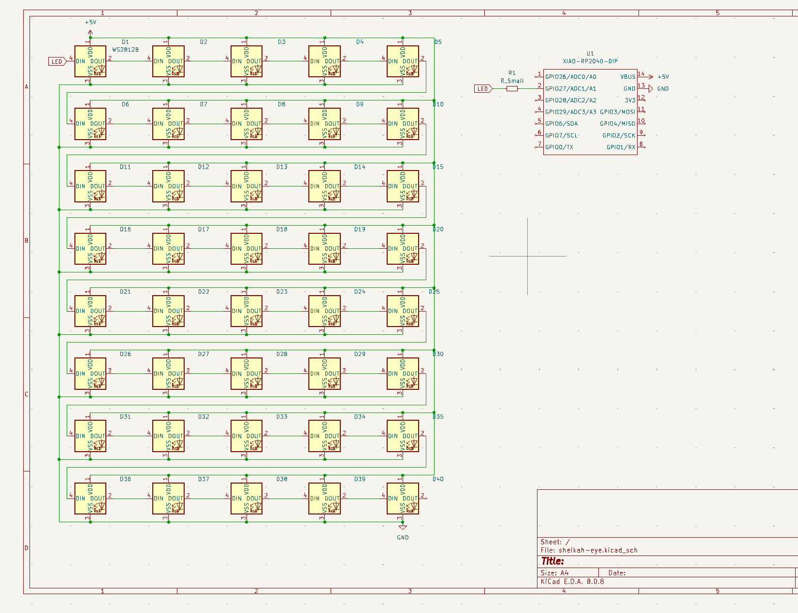
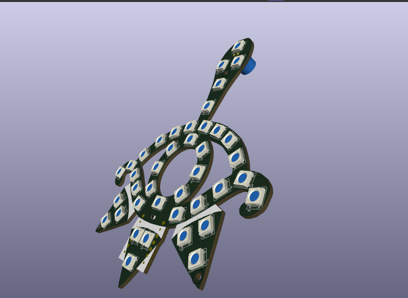

# SHEIKAH EYE

Wokwi link: [https://wokwi.com/projects/428150748420308993](https://wokwi.com/projects/428150748420308993)

I was inspired greatly by the art in Legend of Zelda, Breath of the Wild, and decided to task myself with making the yiga clan symbol (shiekah eye upside down). They paint it in red, so I decided I would make the LED's pulse red.

| Comment          | Footprint                          | Quantity | LCSC   | Cost  |
| ---------------- | ---------------------------------- | -------- | ------ | ----- |
| 330 ohm resistor | Resistor_SMD:R_0805_2012Metric     | 1        | C15008 | 0.10$ |
| WS2812B          | LED_WS2812B_PLCC4_5.0x5.0mm_P3.2mm | 40       |        |
| XIAO-RP2040-DIP  | XIAO-RP2040-DIP                    | 1        |        |

I had a lot of difficulty with placing the LED's inside the outline of the sheikah eye, since it had a lot of tight spaces. Luckily, I found out 30mins into trying to route the giant mess, I could use the autorouter instead which saved me hours of time.
