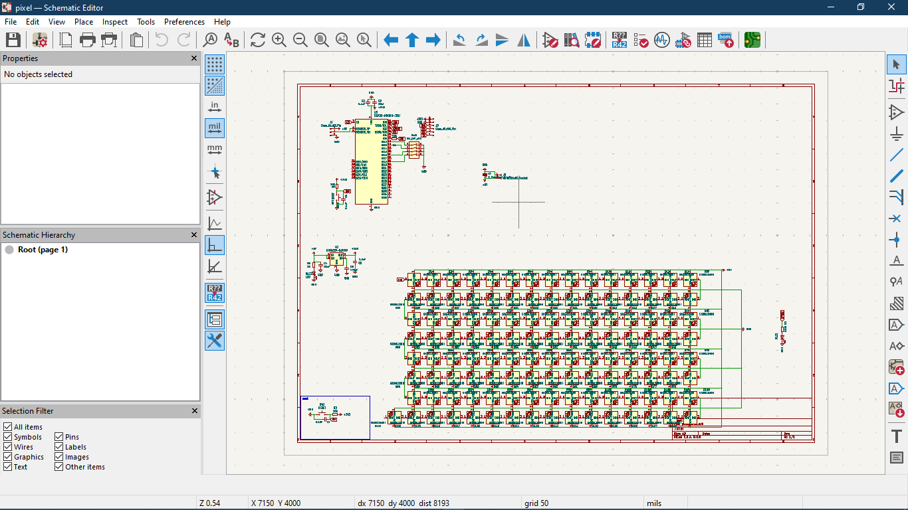
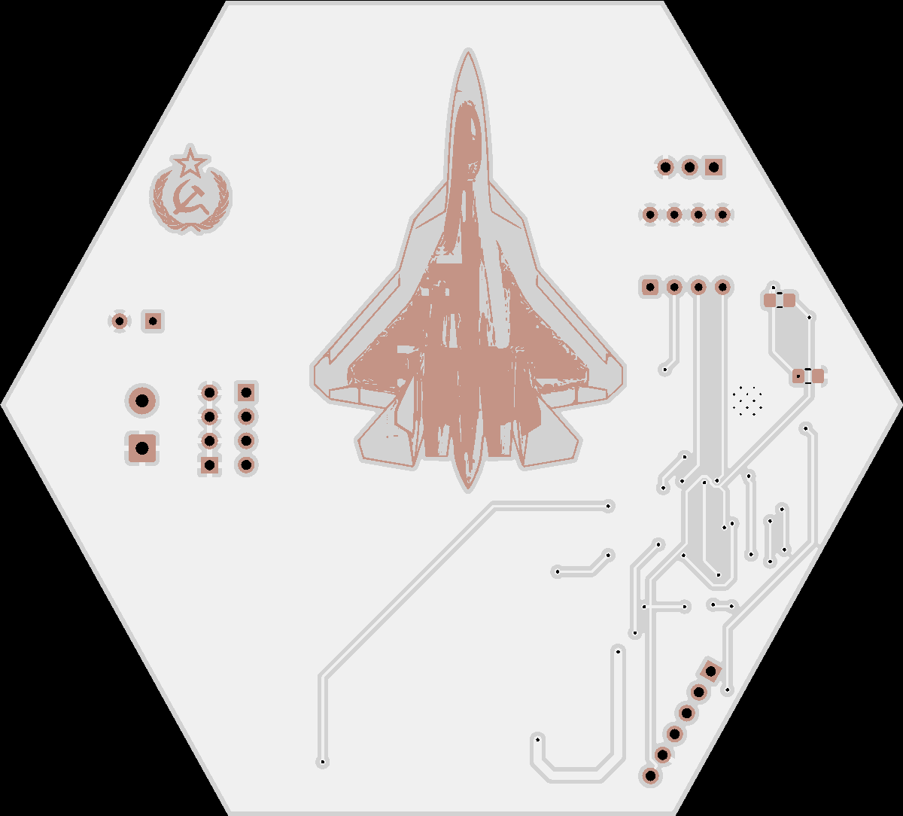
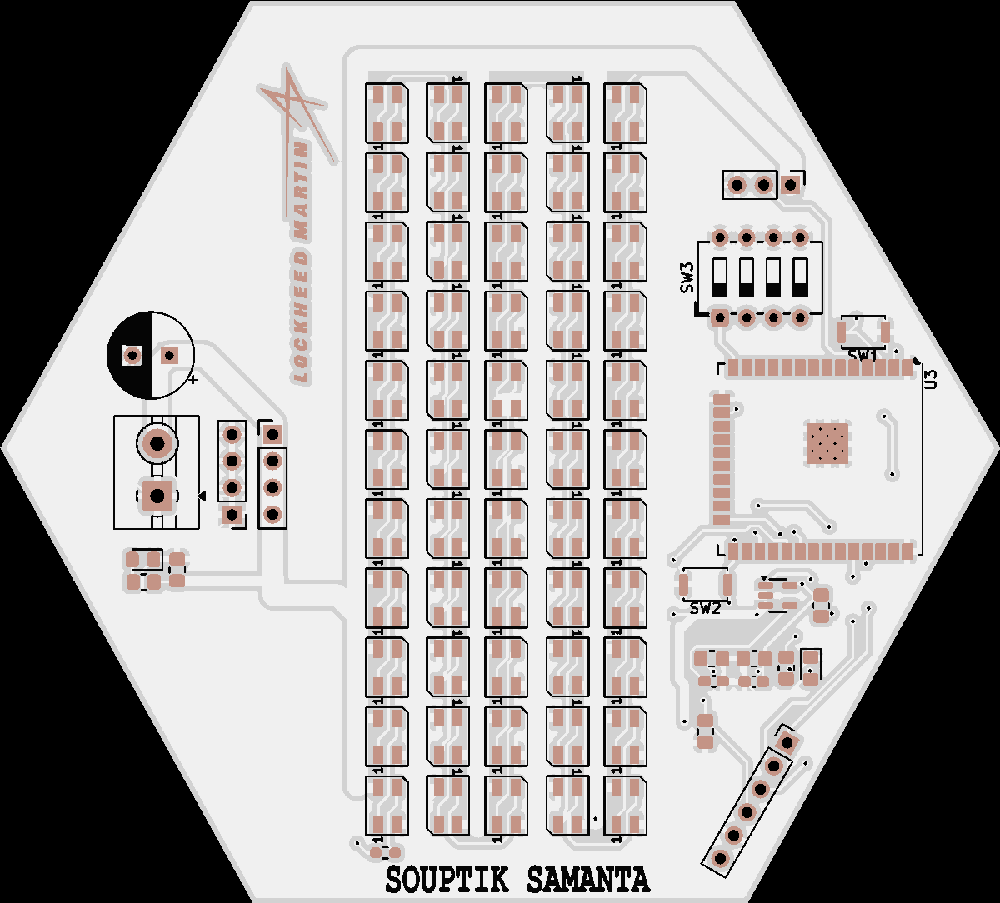
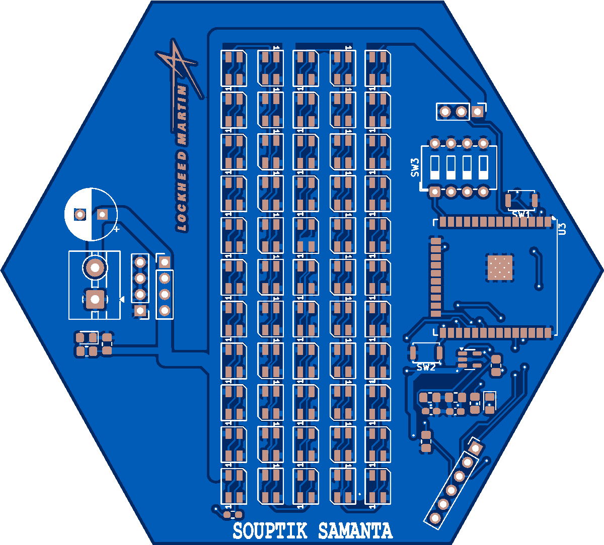
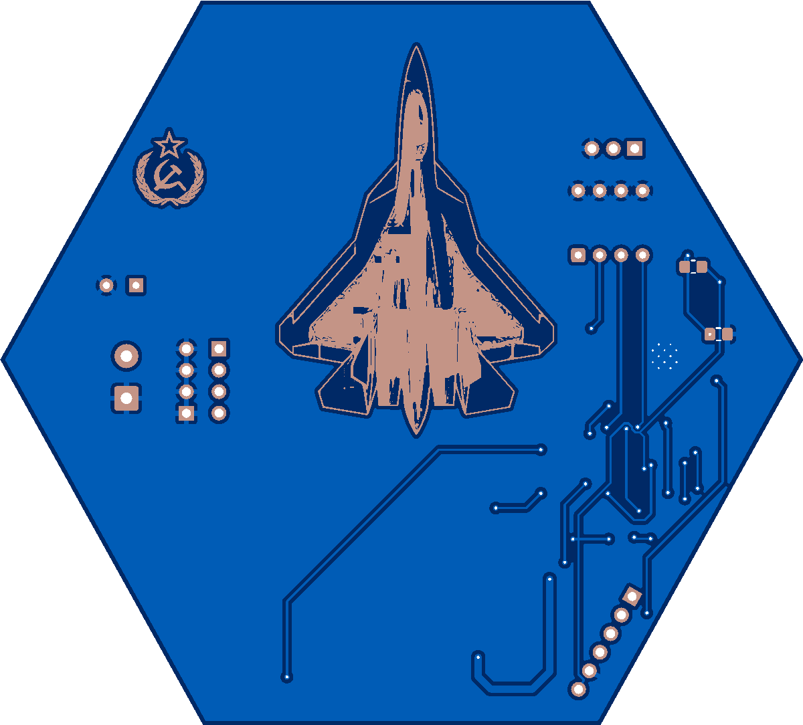

# Pixel Matrix

Wokwi link: https://wokwi.com/projects/429317036413027329

rgb matrix to show thing on it 

(pls include rough pricing of any extra components you're using 

parts 
QTY | PART | Approx Price | LCSC
1 | MIC5219-3.3 LDO Voltage Regulator | $0.162 | C42422052
1 | ESP32-WROOM-32U-N4| $3.44 | PCBA | C328062
1 | 6.3V 1000uF Electrolytic Capacitor | $0.1184 | C1587372
125 | SK6812MINI-EA Addressable RGB LEDs | $9.30 | C5378731

eh pretty easy 

 
