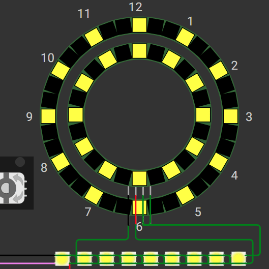
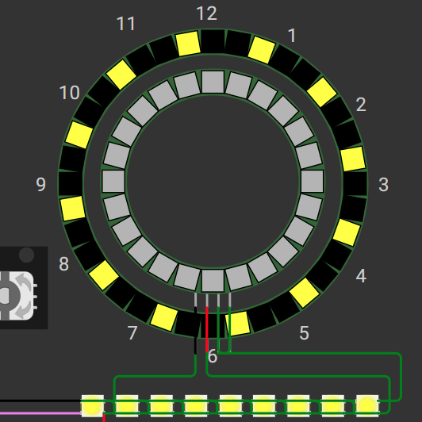
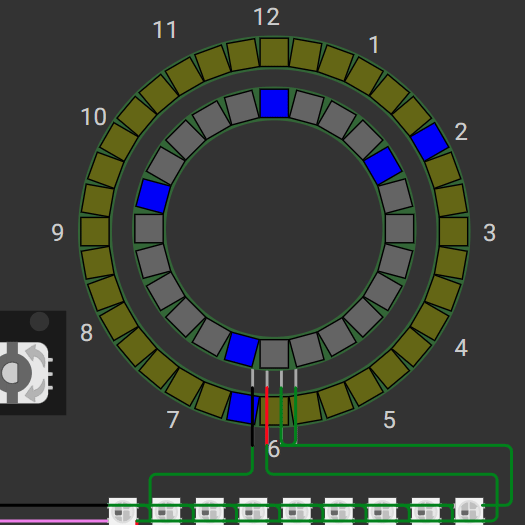
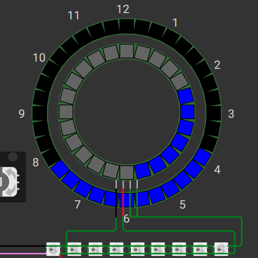
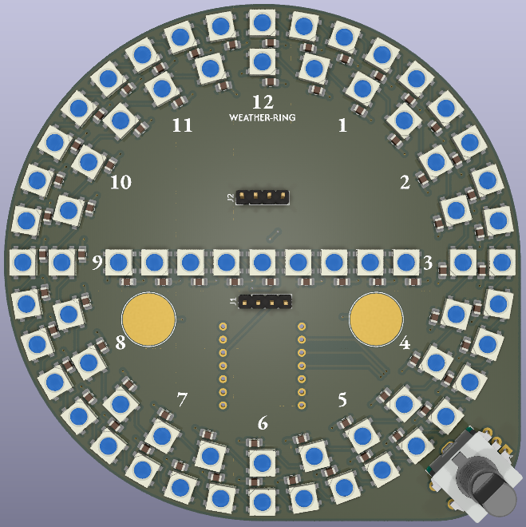
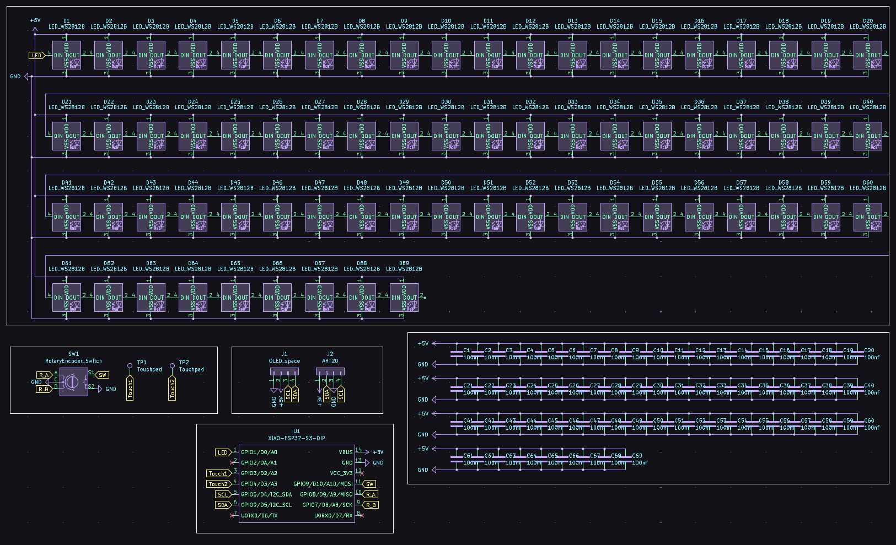

# Weather-Ring

🟢 I can solder everything myself 🟢

Wokwi link: [https://wokwi.com/projects/428319434916413441](https://wokwi.com/projects/428319434916413441)

the AHT20 and touchpads aren't supported in Wokwi so i plan to implement and update it when I get it using [this library](https://github.com/targetblank/micropython_ahtx0)

# Description
<!-- Describe your board in 2-3 sentences. What are you making? What will it do? Please add a lot of pictures here!! -->
This board contains a line of 9 pixels surrounded by 2 rings of 24 and 36 pixels. The pixels are meant to display different animations depending on the current weather retrieved from [Open-Meteo.com's API](https://open-meteo.com). It can also go through the forecast of the day with the rotary encoder.

Sunny Day

Cloudy Day

Day Drizzle

Rainy Night

> there are current 12 animations

# Simplified BOM Table

| Comment           | Footprint                                      | Quantity       | LCSC     | Cost           | AliExpress |
|-------------------|------------------------------------------------|----------------|----------|----------------|------------|
| 0805 100uF        | C_0805_2012Metric_HandSolder_EDITED            | 100* (69 used) | C476766  | $0.39 for 100  |            |
| Any WS2812B-5050  | LED_WS2812B_EDITED                             | 70* (69 used)  | C2843785 | $3.47          |            |
| XIAO-ESP32S3-DIP  | XIAO-ESP32-S3-DIP                              | 1              | ?        | $7.49          |            |
| EC11              | RotaryEncoder_EC11                             | 1              | C2991196 | $1.13          |            |
| AHT20 (board)     | PinHeader_1x04_P2.54mm_Vertical                | 1              |          | $1             | [Link][1]  |
[1]: <https://www.aliexpress.us/item/3256806682863351.html>
* *quantity in multiples only

# Challenges 
<!--Tell us a little bit about your design process. What were some challenges? What helped?-->
> Placing the pixels in a circle was difficult. In the PCB Edtior, I accomplished this by right clicking a pixel and creating a circular array with a negative angle since I chose to have my pixels upside down. From here I encountered a problem where the starting pixel for some reason went to an angled position to the right while I wanted it at the top, so I created an array with a positive angle, duplicated the starting pixel, deleted the array, and created a new one with the new starting pixel and a negative angle, making the starting pixel begin at the top.

> I couldn't think of a way to wire the pixels with a 5V thick track so I opted for a 5V plane on the bottom and using vias to connect the pixels to power.

# PCB & Schematic Images

PCB

Schematic

