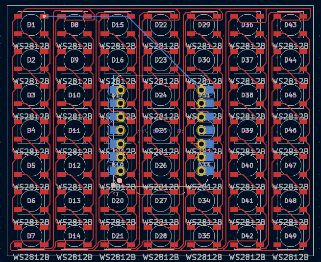

# TheJSMatrix

Wokwi link: https://wokwi.com/projects/425636904873645057

<!-- Uncomment the line below if you need a soldering iron -->
<!-- ⚠️ I would like to [reason for iron], so I would need a soldering iron. -->

It's a simple 7x7 LED matrix to display different designs for my FRC team Wave Robotics. I may also plan on adding web support some how so I could upload a 7x7 image, or maybe just make it simpler to customize. But as of right now it display the text `WAVE 2826` by flashing each character (execpt the space) independently.

| Comment         | Footprint                             | Quantity | LCSC   | Cost   |
|-----------------|---------------------------------------|----------|--------|--------|
| WS2812B         | LED_WS2812B_PLCC4_5.0x5.0mm_P3.2mm   | 49       |        |        |
| XIAO-RP2040-DIP | XIAO-RP2040-DIP                      | 1        |        |        |

Tell us a little bit about your design process. What were some challenges? What helped?
The main challenge was programming it as I wired it in kind of a weird way as I went top to bottom, when matrixes normally go side to side, also wiring it to keep it compact was hard, as the traces are very close togeather.

Some images of your design (make sure to include both the PCB and Schematic!):
| PCB | SCHEM |
|-----|-------|
|||
